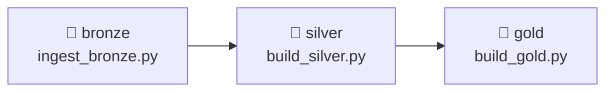
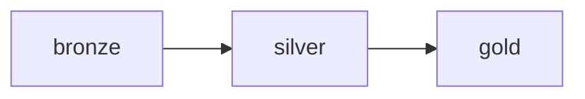

# 5.2 Build the medallion DAG

## Concept
In [Unit 4](../unit4/fundamentals.md) you wrote three Spark jobs for ShopFlow: one that ingests
raw data into **Bronze**, one that cleans and conforms it into **Silver**, and one that
aggregates it into **Gold**. Run out of order they produce garbage — Gold reads Silver, Silver
reads Bronze. **The order *is* the pipeline.**

Now you'll capture that order as a single Airflow DAG: three tasks, one arrow between each,
running the exact same `spark-submit` commands — except Airflow enforces the sequence, retries
failures, and records every run.



**Why `BashOperator` + `spark-submit`?** It works identically on the local Docker stack and on
k8s — Airflow just shells out to `spark-submit`, which submits to the Spark cluster. It's portable
and easy to debug (the full command is right there in the logs). The three job scripts
(`ingest_bronze.py`, `build_silver.py`, `build_gold.py`) are the Unit 4 medallion logic packaged
as runnable files.

!!! note "Sharing the cluster: `spark.cores.max`"
    The standalone Spark cluster is shared between your notebooks (Spark Connect) and these
    Airflow jobs. By default one app grabs *all* cores, starving the others — so every submit
    here passes `--conf spark.cores.max=2` to leave room. (You'll see jobs sit in *WAITING* if
    the cluster is out of cores.)

## Lab

### 1. Create the DAG
Create `code/airflow/dags/shopflow_medallion.py`. Build the `spark-submit` command once as a
helper so all three tasks stay consistent, then wire them with `>>`:

```python
from airflow.sdk import DAG
from airflow.providers.standard.operators.bash import BashOperator
import pendulum

JOBS = "/code/shared/jobs"                    # compose; on k8s these are git-synced with the DAGs
SPARK_MASTER = "spark://spark-master:7077"

def spark_job(script: str) -> str:
    """A spark-submit command for one medallion job (writes the iceberg catalog)."""
    return (
        f"spark-submit --master {SPARK_MASTER} "
        "--conf spark.sql.catalogImplementation=in-memory "   # this stack has no Hive Metastore
        "--conf spark.cores.max=2 "                           # share the cluster with notebooks
        f"{JOBS}/{script} --catalog iceberg"
    )

with DAG(
    dag_id="shopflow_medallion",
    description="Bronze → Silver → Gold for ShopFlow",
    schedule=None,                  # run manually in this lesson; 5.3 adds a schedule
    start_date=pendulum.datetime(2026, 1, 1, tz="UTC"),
    catchup=False,
    tags=["unit5", "medallion"],
) as dag:

    bronze = BashOperator(task_id="bronze", bash_command=spark_job("ingest_bronze.py"))
    silver = BashOperator(task_id="silver", bash_command=spark_job("build_silver.py"))
    gold   = BashOperator(task_id="gold",   bash_command=spark_job("build_gold.py"))

    # the medallion order — this is the whole point of the DAG
    bronze >> silver >> gold
```

Each job writes to the shared **`iceberg`** catalog, so the tables land as
`iceberg.bronze/silver/gold.*` — the same ones Trino and Superset read.

### 2. See the graph
Open the UI → **shopflow_medallion** → **Graph**. Three boxes, left to right:



If the DAG doesn't appear, check **DAGs → import errors** in the UI (a bad import or typo shows up
there).

### 3. Run it end to end
In the Airflow UI, toggle the DAG **on** (unpause) and click **▶ Trigger**. In **Grid** view:
`bronze` goes green, *then* `silver` starts, *then* `gold`. If `bronze` fails, `silver` and `gold`
stay grey — you never run against half-built data.

Click each task → **Logs** to see the real `spark-submit` output. When all three are green,
confirm the run landed (Trino CLI or Superset, from [Unit 2](../unit2/intro.md)):

```sql
SELECT * FROM iceberg.gold.daily_sales ORDER BY order_date DESC LIMIT 5;
```

## Challenge
Gold has three independent marts (`daily_sales`, `top_products`, `customer_ltv`). Build them **in
parallel** after Silver instead of in one task — so a slow mart doesn't block the others. Use
`build_gold.py --mart <name>` and a Python list for fan-out.

??? note "Solution"
    ```python
    def gold_mart(name: str) -> str:
        return spark_job("build_gold.py") + f" --mart {name}"

    daily = BashOperator(task_id="gold_daily",    bash_command=gold_mart("daily_sales"))
    top   = BashOperator(task_id="gold_top",      bash_command=gold_mart("top_products"))
    ltv   = BashOperator(task_id="gold_ltv",      bash_command=gold_mart("customer_ltv"))

    # bronze → silver, then fan out to the three marts in parallel
    bronze >> silver >> [daily, top, ltv]
    ```
    A Python **list** on either side of `>>` creates fan-out / fan-in. Airflow runs the three
    marts concurrently (subject to available worker slots and `spark.cores.max`).

!!! tip "🎯 The same orchestration on Azure, Databricks, Snowflake & Fabric"
    **What you just did:** chained three Spark jobs as `bronze >> silver >> gold` so each stage
    runs only after the previous one succeeds.

    - **Azure Databricks** — a **Workflow/Job** with three tasks (each a Spark notebook/job)
      linked by `depends_on` — the exact Bronze→Silver→Gold chain.
    - **Azure Data Factory** — a **Pipeline** with three activities (often **Databricks Notebook**
      activities) connected by success arrows.
    - **Snowflake** — three **Tasks** chained with `AFTER` (bronze → silver → gold), often fed by
      **Streams** so Silver only runs on newly ingested data.
    - **Microsoft Fabric** — a **Data Factory in Fabric** pipeline with Notebook activities wired
      by success arrows.

    The Bronze→Silver→Gold dependency chain is the universal shape — and **managed Airflow** on any
    cloud runs this exact file.

## Key terms, at a glance
| Term | Plain meaning |
|---|---|
| **`BashOperator` + `spark-submit`** | Run a Spark job from a task by shelling out |
| **`>>`** | Task order: run the left one, then the right |
| **Fan-out / fan-in** | `a >> [b, c] >> d` — run b and c in parallel |
| **`spark.cores.max`** | Cap an app's cores so jobs share the cluster |
| **`--catalog iceberg`** | Write to the shared lakehouse catalog |
| **Import errors** | Where the UI shows a DAG that failed to parse |

## You can now…
- Turn the Unit 4 Spark jobs into an Airflow DAG with `bronze >> silver >> gold`
- Run `spark-submit` from a `BashOperator` and read the logs in the UI
- Express parallel branches with lists (`>> [a, b] >>`) for fan-out / fan-in
- Share a Spark cluster between notebooks and Airflow with `spark.cores.max`
