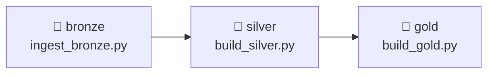
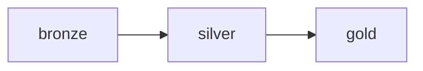

# 5.2 Build the medallion DAG

## Concept
In [Unit 4](../unit4/fundamentals.md) you wrote three Spark jobs for ShopFlow: one that ingests
raw data into **Bronze**, one that cleans and conforms it into **Silver**, and one that
aggregates it into **Gold**. Run out of order they produce garbage — Gold reads Silver, Silver
reads Bronze. **The order *is* the pipeline.**

Now you'll capture that order as a single Airflow DAG: three tasks, one arrow between each,
running the exact same `spark-submit` commands — except Airflow enforces the sequence, retries
failures, and records every run.



Recall the two ideas this lesson fuses together:

- From **Unit 1.4**, the **medallion architecture** — data flows through three layers, each one
  cleaner than the last. **Bronze** is the raw copy, **Silver** is cleaned and conformed, **Gold**
  is the aggregated business tables. Each layer *reads the one before it*.
- From **5.1**, a **DAG** (Directed Acyclic Graph) is how Airflow describes a pipeline: a set of
  **tasks** (the units of work) plus the **dependencies** (arrows) that say which task must finish
  before the next one starts.

The plan for this lesson is one **task per layer** and one arrow between them — so the DAG's shape
*is* the medallion shape. You'll write `ingest → Bronze → Silver → Gold` once, and Airflow will run
it in that order forever.

!!! info "Why layer the pipeline into separate tasks at all?"
    You *could* cram all three Spark jobs into one giant script. Splitting them into one task per
    layer buys you three things:

    - **Debuggable** — when something breaks, the failing box in the UI tells you *which layer*
      failed. A red `silver` box means "Bronze was fine, the cleaning step broke."
    - **Re-runnable** — if `gold` fails, you re-run *just* `gold` on the Silver data that's already
      there. You don't re-ingest from scratch.
    - **Enforced order** — the arrows guarantee Silver never runs on a half-written Bronze. That
      guarantee is the entire reason to use an orchestrator instead of a shell script.

**Why `BashOperator` + `spark-submit`?** It works identically on the local Docker stack and on
k8s — Airflow just shells out to `spark-submit`, which submits to the Spark cluster. It's portable
and easy to debug (the full command is right there in the logs). The three job scripts
(`ingest_bronze.py`, `build_silver.py`, `build_gold.py`) are the Unit 4 medallion logic packaged
as runnable files.

!!! note "Sharing the cluster: `spark.cores.max`"
    The standalone Spark cluster is shared between your notebooks (Spark Connect) and these
    Airflow jobs. By default one app grabs *all* cores, starving the others — so every submit
    here passes `--conf spark.cores.max=2` to leave room. (You'll see jobs sit in *WAITING* if
    the cluster is out of cores.)

## Lab

### 1. Create the DAG
Create `code/airflow/dags/shopflow_medallion.py`. Build the `spark-submit` command once as a
helper so all three tasks stay consistent, then wire them with `>>`:

```python
from airflow.sdk import DAG
from airflow.providers.standard.operators.bash import BashOperator
import pendulum

JOBS = "/code/shared/jobs"                    # compose; on k8s these are git-synced with the DAGs
SPARK_MASTER = "spark://spark-master:7077"

def spark_job(script: str) -> str:
    """A spark-submit command for one medallion job (writes the iceberg catalog)."""
    return (
        f"spark-submit --master {SPARK_MASTER} "
        "--conf spark.sql.catalogImplementation=in-memory "   # this stack has no Hive Metastore
        "--conf spark.cores.max=2 "                           # share the cluster with notebooks
        f"{JOBS}/{script} --catalog iceberg"
    )

with DAG(
    dag_id="shopflow_medallion",
    description="Bronze → Silver → Gold for ShopFlow",
    schedule=None,                  # run manually in this lesson; 5.3 adds a schedule
    start_date=pendulum.datetime(2026, 1, 1, tz="UTC"),
    catchup=False,
    tags=["unit5", "medallion"],
) as dag:

    bronze = BashOperator(task_id="bronze", bash_command=spark_job("ingest_bronze.py"))
    silver = BashOperator(task_id="silver", bash_command=spark_job("build_silver.py"))
    gold   = BashOperator(task_id="gold",   bash_command=spark_job("build_gold.py"))

    # the medallion order — this is the whole point of the DAG
    bronze >> silver >> gold
```

**Read it step by step:**

- **`from airflow.sdk import DAG`** and the `BashOperator` import — `DAG` is the container you
  declare your pipeline in; `BashOperator` is the **operator** that runs a shell command as a task.
  (An *operator* is a pre-built task type; there's one for bash, one for Python, one for SQL, and so
  on. You pick the operator that matches the work.)
- **`JOBS` and `SPARK_MASTER`** — two constants. `JOBS` is the folder holding the three Unit 4 job
  scripts; `SPARK_MASTER` is the address of the Spark cluster the jobs submit to. Pulling them out
  as names keeps the command below readable.
- **`def spark_job(script)`** — a small helper that builds *one* `spark-submit` command string for a
  given script. Every task runs the same shape of command (same master, same configs, same catalog)
  differing only in the script name — so writing it once here means all three tasks stay identical
  and you fix a flag in a single place. The `--conf` flags are Spark tuning (no Hive Metastore on
  this stack; cap cores to share the cluster); `--catalog iceberg` points every job at the shared
  lakehouse.
- **`with DAG(...) as dag:`** — this *defines the DAG*. Everything indented under it belongs to this
  pipeline. The keyword arguments are its identity and settings:
    - **`dag_id="shopflow_medallion"`** — the unique name you'll see and click in the UI.
    - **`schedule=None`** — don't run on a timer; you'll trigger it by hand this lesson (5.3 adds a
      schedule).
    - **`start_date` / `catchup=False`** — when the pipeline "begins" and *not* to back-fill past
      runs. (Covered in 5.1.)
    - **`tags=[...]`** — labels for filtering DAGs in the UI.
- **`bronze = BashOperator(task_id="bronze", bash_command=spark_job("ingest_bronze.py"))`** — this
  creates the first **task**. `task_id` is the box's name in the graph; `bash_command` is what it
  runs — here, the `spark-submit` for the Bronze ingest job. The `silver` and `gold` lines do the
  same for their layers. At this point you have three tasks defined but *not yet connected*.
- **`bronze >> silver >> gold`** — this is the whole point of the DAG. The **`>>`** operator sets a
  **dependency**: `bronze >> silver` means "run `bronze` first; only when it succeeds, run
  `silver`." Chaining it wires the full medallion order. `bronze` is *upstream* of `silver`;
  `gold` is *downstream* of `silver`.

**The resulting task graph:** three boxes in a straight line, `bronze → silver → gold`. Airflow
reads the `>>` arrows and knows the run order without you scheduling each step by hand — Silver
physically cannot start until Bronze reports success, and Gold cannot start until Silver does.

Each job writes to the shared **`iceberg`** catalog, so the tables land as
`iceberg.bronze/silver/gold.*` — the same ones Trino and Superset read.

### 2. See the graph
Airflow parses your `.py` file, reads the `>>` arrows, and draws the pipeline for you. Open the
UI → **shopflow_medallion** → **Graph**. You'll see exactly what you wired — three boxes, left to
right, one arrow between each:



This graph *is* your `bronze >> silver >> gold` line, drawn out. Each box is a task; each arrow is a
dependency. Reading left to right gives you the run order at a glance: the arrow into `silver` means
"waits for `bronze`," and the arrow into `gold` means "waits for `silver`." (During a run these boxes
change colour — green for success, running, failed — which is what makes the layering so easy to
debug.)

If the DAG doesn't appear, check **DAGs → import errors** in the UI (a bad import or typo shows up
there).

### 3. Run it end to end
In the Airflow UI, toggle the DAG **on** (unpause) and click **▶ Trigger**. In **Grid** view:
`bronze` goes green, *then* `silver` starts, *then* `gold`. Watch the order — this is the `>>`
dependency doing its job. `silver` sits idle until `bronze` reports success; `gold` waits on
`silver`. If `bronze` fails, `silver` and `gold` stay grey — you never run against half-built data.
That's the **re-runnable** promise from the top of the lesson: fix the failing layer, re-trigger,
and the downstream tasks pick up the clean data.

Click each task → **Logs** to see the real `spark-submit` output. When all three are green,
confirm the run landed (Trino CLI or Superset, from [Unit 2](../unit2/intro.md)):

```sql
SELECT * FROM iceberg.gold.daily_sales ORDER BY order_date DESC LIMIT 5;
```

## Challenge
So far the pipeline is a straight line. But dependencies only need to be real: Gold has three
independent marts (`daily_sales`, `top_products`, `customer_ltv`) that all read Silver but *don't*
depend on each other — so there's no reason to run them one after another. Build them **in parallel**
after Silver instead of in one task, so a slow mart doesn't block the others. Use
`build_gold.py --mart <name>` and a Python list for fan-out.

??? note "Solution"
    ```python
    def gold_mart(name: str) -> str:
        return spark_job("build_gold.py") + f" --mart {name}"

    daily = BashOperator(task_id="gold_daily",    bash_command=gold_mart("daily_sales"))
    top   = BashOperator(task_id="gold_top",      bash_command=gold_mart("top_products"))
    ltv   = BashOperator(task_id="gold_ltv",      bash_command=gold_mart("customer_ltv"))

    # bronze → silver, then fan out to the three marts in parallel
    bronze >> silver >> [daily, top, ltv]
    ```
    A Python **list** on either side of `>>` creates fan-out / fan-in. Airflow runs the three
    marts concurrently (subject to available worker slots and `spark.cores.max`).

!!! tip "🎯 The same orchestration on Azure, Databricks, Snowflake & Fabric"
    **What you just did:** chained three Spark jobs as `bronze >> silver >> gold` so each stage
    runs only after the previous one succeeds.

    - **Azure Databricks** — a **Workflow/Job** with three tasks (each a Spark notebook/job)
      linked by `depends_on` — the exact Bronze→Silver→Gold chain.
    - **Azure Data Factory** — a **Pipeline** with three activities (often **Databricks Notebook**
      activities) connected by success arrows.
    - **Snowflake** — three **Tasks** chained with `AFTER` (bronze → silver → gold), often fed by
      **Streams** so Silver only runs on newly ingested data.
    - **Microsoft Fabric** — a **Data Factory in Fabric** pipeline with Notebook activities wired
      by success arrows.

    The Bronze→Silver→Gold dependency chain is the universal shape — and **managed Airflow** on any
    cloud runs this exact file.

## Key terms, at a glance
| Term | Plain meaning |
|---|---|
| **DAG** | The whole pipeline as code — tasks plus the arrows between them; "acyclic" = no loops back |
| **Task** | One unit of work in the DAG (here, one Spark job = one box in the graph) |
| **Operator** | A pre-built task type; `BashOperator` runs a shell command |
| **Dependency (`>>`)** | Run order: `a >> b` means run `a` first, then `b` only if it succeeded |
| **Task graph** | The boxes-and-arrows drawing Airflow builds from your `>>` lines |
| **Upstream / downstream** | Upstream = must run first; downstream = waits on it (`bronze` is upstream of `silver`) |
| **Medallion pipeline** | The `ingest → Bronze → Silver → Gold` chain, one task per layer |
| **`BashOperator` + `spark-submit`** | Run a Spark job from a task by shelling out |
| **Fan-out / fan-in** | `a >> [b, c] >> d` — run b and c in parallel |
| **`spark.cores.max`** | Cap an app's cores so jobs share the cluster |
| **`--catalog iceberg`** | Write to the shared lakehouse catalog |
| **Import errors** | Where the UI shows a DAG that failed to parse |

## You can now…
- Turn the Unit 4 Spark jobs into an Airflow DAG with `bronze >> silver >> gold`
- Run `spark-submit` from a `BashOperator` and read the logs in the UI
- Express parallel branches with lists (`>> [a, b] >>`) for fan-out / fan-in
- Share a Spark cluster between notebooks and Airflow with `spark.cores.max`
