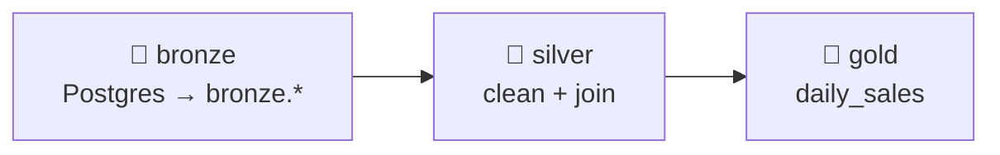
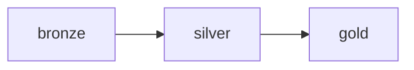

# 5.2 Build the medallion DAG

## Concept
In [Unit 4](../unit4/fundamentals.md) you wrote three Spark jobs for ShopFlow: one that ingests
raw data into **Bronze**, one that cleans and conforms it into **Silver**, and one that
aggregates it into **Gold**. Run out of order they produce garbage — Gold reads Silver, Silver
reads Bronze. **The order *is* the pipeline.**

Now you'll capture that order as a single Airflow DAG: three tasks, one arrow between each,
doing the same work as your Unit 4 notebooks — except Airflow enforces the sequence, retries
failures, and records every run.


```mermaid
flowchart LR
  B["🥉 bronze<br/>Postgres → bronze.*"] --> S["🥈 silver<br/>clean + join"] --> G["🥇 gold<br/>daily_sales"]
```

Recall the two ideas this lesson fuses together:

- From **Unit 1.4**, the **medallion architecture** — data flows through three layers, each one
  cleaner than the last. **Bronze** is the raw copy, **Silver** is cleaned and conformed, **Gold**
  is the aggregated business tables. Each layer *reads the one before it*.
- From **5.1**, a **DAG** (Directed Acyclic Graph) is how Airflow describes a pipeline: a set of
  **tasks** (the units of work) plus the **dependencies** (arrows) that say which task must finish
  before the next one starts.

The plan for this lesson is one **task per layer** and one arrow between them — so the DAG's shape
*is* the medallion shape.

!!! info "Why layer the pipeline into separate tasks at all?"
    You *could* cram all three steps into one giant task. Splitting them into one task per layer
    buys you three things:

    - **Debuggable** — when something breaks, the failing box in the UI tells you *which layer*
      failed. A red `silver` box means "Bronze was fine, the cleaning step broke."
    - **Re-runnable** — if `gold` fails, you re-run *just* `gold` on the Silver data that's already
      there. You don't re-ingest from scratch.
    - **Enforced order** — the arrows guarantee Silver never runs on a half-written Bronze. That
      guarantee is the entire reason to use an orchestrator instead of a shell script.

!!! info "Where does the Spark work run? — `lab_spark()`"
    A task is plain Python running inside Airflow — but the data work is Spark, and Spark runs on
    the lab's **Spark cluster**, not inside Airflow. Each task calls **`lab_spark()`**, which opens
    a Spark session on the cluster **signed in as you**: exactly like your notebook, `iceberg` is
    **your own lakehouse** (`demouser_lake`) and `shared` is the course lake. So the tables this
    DAG writes are the same ones you built by hand in Unit 4.

## Lab

### 1. Create the DAG
In Jupyter's **`dags/`** folder create **`medallion.py`**. Each layer is a `@task` function; the
last line wires them with `>>`:

```python
import pendulum
from airflow.sdk import dag, task

PG = {"url": "jdbc:postgresql://postgres:5432/shopflow", "user": "postgres",
      "password": "postgres", "driver": "org.postgresql.Driver"}


@dag(
    dag_id="demouser_medallion",          # own account? use your username instead of demouser
    description="Bronze → Silver → Gold for ShopFlow",
    schedule=None,                        # manual for now; 5.3 adds a schedule
    start_date=pendulum.datetime(2026, 1, 1, tz="UTC"),
    catchup=False,
    tags=["unit5", "medallion"],
)
def medallion():

    @task
    def bronze():
        """Land the four ShopFlow source tables as-is (raw copy)."""
        from lab_spark import lab_spark
        spark = lab_spark()                                    # signed in as you
        for t in ["customers", "products", "orders", "order_items"]:
            (spark.read.format("jdbc").options(**PG, dbtable=t).load()
                  .writeTo(f"iceberg.bronze.{t}").createOrReplace())
            print("bronze", t, spark.table(f"iceberg.bronze.{t}").count())

    @task
    def silver():
        """Clean + join Bronze into one order-line table."""
        from lab_spark import lab_spark
        from pyspark.sql import functions as F
        spark = lab_spark()
        o = (spark.table("iceberg.bronze.orders")
             .withColumn("order_date", F.to_date("order_ts"))
             .dropDuplicates(["order_id"]))
        i = spark.table("iceberg.bronze.order_items").dropDuplicates(["order_id", "product_id"])
        c = spark.table("iceberg.bronze.customers")
        p = spark.table("iceberg.bronze.products")
        silver = (i.join(o, "order_id").join(c, "customer_id", "left").join(p, "product_id", "left")
                  .select("order_id", "order_date", "customer_id",
                          F.col("full_name").alias("customer_name"), "country", "channel",
                          "product_id", F.col("name").alias("product_name"), "category",
                          "quantity", i["unit_price"],
                          (i["quantity"] * i["unit_price"]).cast("decimal(12,2)").alias("line_amount"),
                          "status"))
        silver.writeTo("iceberg.silver.orders").createOrReplace()
        print("silver.orders", spark.table("iceberg.silver.orders").count())

    @task
    def gold():
        """Business mart: delivered revenue per day."""
        from lab_spark import lab_spark
        spark = lab_spark()
        spark.sql("""
            CREATE OR REPLACE TABLE iceberg.gold.daily_sales AS
            SELECT order_date, count(DISTINCT order_id) AS orders,
                   sum(line_amount) AS revenue, sum(quantity) AS units
            FROM iceberg.silver.orders
            WHERE status = 'delivered'
            GROUP BY order_date""")
        print("gold.daily_sales", spark.table("iceberg.gold.daily_sales").count())

    bronze() >> silver() >> gold()


medallion()
```

**Read it step by step:**

- **`@dag(...)`** above `def medallion():` — the **TaskFlow** way to define a DAG: the decorated
  function *is* the pipeline, and calling `medallion()` at the bottom registers it. Same arguments
  as `with DAG(...)` in [5.1](basics.md): `dag_id` (your username first), `schedule=None` (manual),
  `start_date`, `catchup=False`, `tags`.
- **`@task`** above `def bronze():` — turns a plain Python function into an Airflow **task**. The
  function name becomes the `task_id` (`bronze`, `silver`, `gold` — the boxes in the Graph).
- **`from lab_spark import lab_spark` / `spark = lab_spark()`** — inside each task, open a Spark
  session as you. The import sits *inside* the function so Airflow can read the DAG file quickly
  without starting Spark.
- **`bronze`** — reads the four ShopFlow tables from Postgres over **JDBC** (the `PG` settings) and
  writes each one to `iceberg.bronze.<table>` with **`createOrReplace()`** — a full reload, safe to
  re-run ([4.2](../unit4/read-bronze.md)).
- **`silver`** — joins order lines with their order, customer and product, renames columns and
  computes `line_amount` — the Silver table from [4.3](../unit4/transform-silver.md).
- **`gold`** — the `daily_sales` mart with Spark SQL: delivered orders per day — the same query as
  [4.4](../unit4/spark-sql-gold.md).
- **`bronze() >> silver() >> gold()`** — calling each task function creates the task; `>>` sets the
  order. **This line is the medallion.**

### 2. See the graph
Airflow parses your `.py` file, reads the `>>` arrows, and draws the pipeline for you. Open the
UI → **demouser_medallion** → **Graph**. You'll see exactly what you wired — three boxes, left to
right, one arrow between each:


```mermaid
flowchart LR
  B[bronze] --> S[silver] --> G[gold]
```

This graph *is* your `bronze() >> silver() >> gold()` line, drawn out. Each box is a task; each
arrow is a dependency. (During a run these boxes change colour — green for success, running,
failed — which is what makes the layering so easy to debug.)

If the DAG doesn't appear within a minute, check **import errors** in the Airflow UI (a typo, a
bad import, or a `dag_id` that doesn't start with your username shows up there).

### 3. Run it end to end
In the Airflow UI, toggle the DAG **on** (unpause) and click **▶ Trigger**. In **Grid** view:
`bronze` goes green, *then* `silver` starts, *then* `gold` — about a minute in total. `silver` sits
idle until `bronze` reports success; `gold` waits on `silver`. If `bronze` fails, `silver` and
`gold` stay grey — you never run against half-built data. Fix the failing layer, re-trigger, and
the downstream tasks pick up the clean data.

Click each task → **Logs**: you'll see `lab_spark: you are demouser · iceberg = demouser_lake` and
the row counts each task printed (`bronze orders 40000`, `silver.orders 100000`,
`gold.daily_sales 731`). Then confirm the result in your lakehouse — in a notebook:

```sql
%%sql
SELECT * FROM iceberg.gold.daily_sales ORDER BY order_date DESC LIMIT 5
```

or in SQLPad / Trino, where your lakehouse is `demouser_lake`:

```sql
SELECT * FROM demouser_lake.gold.daily_sales ORDER BY order_date DESC LIMIT 5;
```

## Challenge
So far the pipeline is a straight line. But dependencies only need to be real: Gold can have several
independent marts that all read Silver but *don't* depend on each other — so there's no reason to
run them one after another. Add a second mart, **`gold.top_products`** (delivered revenue and units
per product), as its own task that runs **in parallel** with `gold` after `silver`.

??? note "Solution"
    Add a task next to `gold`:
    ```python
    @task
    def top_products():
        """Business mart: revenue + units per product."""
        from lab_spark import lab_spark
        spark = lab_spark()
        spark.sql("""
            CREATE OR REPLACE TABLE iceberg.gold.top_products AS
            SELECT product_id, product_name, category,
                   sum(line_amount) AS revenue, sum(quantity) AS units
            FROM iceberg.silver.orders
            WHERE status = 'delivered'
            GROUP BY product_id, product_name, category""")
    ```
    and change the last line to fan out after Silver:
    ```python
    s = silver()
    bronze() >> s >> [gold(), top_products()]
    ```
    A Python **list** on the right of `>>` creates **fan-out**: both marts wait for `silver`, then
    run at the same time. (`[a, b] >> c` would be the opposite — **fan-in**.)

!!! tip "🎯 The same orchestration on Azure, Databricks, Snowflake & Fabric"
    **What you just did:** chained three Spark steps as `bronze >> silver >> gold` so each stage
    runs only after the previous one succeeds.

    - **Azure Databricks** — a **Workflow/Job** with three tasks (each a Spark notebook/job)
      linked by `depends_on` — the exact Bronze→Silver→Gold chain.
    - **Azure Data Factory** — a **Pipeline** with three activities (often **Databricks Notebook**
      activities) connected by success arrows.
    - **Snowflake** — three **Tasks** chained with `AFTER` (bronze → silver → gold), often fed by
      **Streams** so Silver only runs on newly ingested data.
    - **Microsoft Fabric** — a **Data Factory in Fabric** pipeline with Notebook activities wired
      by success arrows.

    The Bronze→Silver→Gold dependency chain is the universal shape — and **managed Airflow** on any
    cloud runs this exact file.

## Key terms, at a glance
| Term | Plain meaning |
|---|---|
| **DAG** | The whole pipeline as code — tasks plus the arrows between them; "acyclic" = no loops back |
| **Task** | One unit of work in the DAG (here, one layer = one box in the graph) |
| **`@dag` / `@task`** | TaskFlow decorators: a function becomes the DAG / a task |
| **`lab_spark()`** | Opens a Spark session on the cluster, signed in as you (`iceberg` = your lakehouse) |
| **Dependency (`>>`)** | Run order: `a >> b` means run `a` first, then `b` only if it succeeded |
| **Task graph** | The boxes-and-arrows drawing Airflow builds from your `>>` lines |
| **Upstream / downstream** | Upstream = must run first; downstream = waits on it (`bronze` is upstream of `silver`) |
| **Medallion pipeline** | The `ingest → Bronze → Silver → Gold` chain, one task per layer |
| **Fan-out / fan-in** | `a >> [b, c] >> d` — run b and c in parallel |
| **Import errors** | Where the UI shows a DAG that failed to parse |

## You can now…
- Turn your Unit 4 medallion into an Airflow DAG with `bronze() >> silver() >> gold()`
- Write tasks with `@task` that do Spark work as you via `lab_spark()`, and read their logs in the UI
- Express parallel branches with lists (`>> [a, b]`) for fan-out / fan-in
