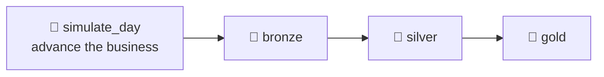

# 5.3 Schedule ingestion & Spark jobs

## Concept
ShopFlow is a *living* business: every day brings new orders, price changes, and late-arriving
records. A small generator, `simulate_day.py`, stands in for reality — it inserts a day's new
orders into Postgres for a given date. In production that new data would arrive on its own.

A daily pipeline therefore has **four** steps: advance the day, then run the Bronze → Silver →
Gold medallion from [5.2](medallion-dag.md).



Until now you ran the medallion by hand. A *scheduled* pipeline runs itself on a clock — and once
it does, three new questions appear: what happens if the same date runs **twice**? what happens
when a step **fails**? and how do you fill in dates the scheduler **missed**? Three ideas answer
them and make a scheduled pipeline trustworthy:

- **Idempotency** — re-running a date must produce the same result, not duplicates. "Idempotent"
  means an operation lands in the same final state no matter how many times you apply it. The
  Bronze/Silver/Gold jobs here **rebuild from source** with `createOrReplace`, so a re-run simply
  replaces the tables — inherently safe. (In production you'd optimise to *incremental*:
  partition-overwrite Bronze and `MERGE` Silver — the same `MERGE` from [2.6](../unit2/merge.md) /
  [4.3](../unit4/transform-silver.md). The orchestration is identical either way.)
- **Retries** — transient failures (a Postgres hiccup) should self-heal before paging anyone.
  Airflow can re-run a failed task a few times, waiting between attempts, before it gives up.
- **Catchup / backfill** — if the scheduler was down for three days, Airflow can run the missed
  dates in order; and you can deliberately re-run a historical range. Both mean the same mechanic:
  the scheduler treats every *date* as its own run and executes them one at a time.

!!! info "New vocabulary in this lesson"
    This lesson introduces the words that turn a DAG into a *scheduled* pipeline: a **schedule
    interval** (a cron string like `0 6 * * *`, or a preset like `@daily`), a **`start_date`**,
    **`catchup`**/**backfill**, **`retries`**, running a **Spark job** from a task with
    **`spark-submit`**, and **templating** with **`{{ ds }}`** (the run's business date). Each is
    explained the first time it appears below, and all are collected in *Key terms* at the end.

## Lab

### 1. Add a daily schedule + retries
Create `code/airflow/dags/shopflow_daily.py`. The generator runs first, using the run's business
date (`{{ ds }}`); then the medallion rebuilds so the new day is included.

This is the whole lesson in one file. It's long, so read the code once for shape, then work
through the **step-by-step** breakdowns below it — each construct is explained the first time it
appears.

```python
from airflow.sdk import DAG
from airflow.providers.standard.operators.bash import BashOperator
from datetime import timedelta
import pendulum

JOBS = "/code/shared/jobs"
SPARK_MASTER = "spark://spark-master:7077"

def spark_job(script: str) -> str:
    return (
        f"spark-submit --master {SPARK_MASTER} "
        "--conf spark.sql.catalogImplementation=in-memory "
        "--conf spark.cores.max=2 "
        f"{JOBS}/{script} --catalog iceberg"
    )

default_args = {
    "retries": 2,
    "retry_delay": timedelta(minutes=2),   # wait, then try again
}

with DAG(
    dag_id="shopflow_daily",
    description="Daily: simulate a day, then rebuild Bronze→Silver→Gold",
    schedule="0 6 * * *",                  # every day at 06:00 UTC
    start_date=pendulum.datetime(2026, 9, 1, tz="UTC"),
    catchup=False,                         # don't backfill history on first deploy
    max_active_runs=1,                     # one day at a time — avoids overlap
    default_args=default_args,
    tags=["unit5", "daily"],
) as dag:

    simulate = BashOperator(
        task_id="simulate_day",
        bash_command="python " + JOBS + "/simulate_day.py --date {{ ds }}",
    )
    bronze = BashOperator(task_id="bronze", bash_command=spark_job("ingest_bronze.py"))
    silver = BashOperator(task_id="silver", bash_command=spark_job("build_silver.py"))
    gold   = BashOperator(task_id="gold",   bash_command=spark_job("build_gold.py"))

    simulate >> bronze >> silver >> gold
```

**Read it step by step:**

- **`from airflow.providers.standard.operators.bash import BashOperator`** — a `BashOperator` is a
  task that runs a **shell command**. Every task in this DAG is one: it shells out to run either the
  Python generator or a Spark job. (Contrast with `PythonOperator`, which calls a Python function
  in-process.)
- **`JOBS` / `SPARK_MASTER`** — plain constants: where the job scripts live inside the container,
  and the address of the Spark cluster's master. Naming them once keeps the tasks readable.

- **`def spark_job(script)`** — a small helper that builds the **`spark-submit`** command line.
  `spark-submit` is the standard way to hand a script to a Spark cluster: it ships the code to the
  cluster, runs it, and waits for it to finish. Reading the string it returns:
    - **`--master {SPARK_MASTER}`** — which Spark cluster to run on (`spark://spark-master:7077`).
    - **`--conf spark.sql.catalogImplementation=in-memory`** and **`--conf spark.cores.max=2`** —
      Spark tuning knobs: no built-in Hive metastore, and cap the job at 2 cores so one run can't
      starve the small local cluster.
    - **`{JOBS}/{script} --catalog iceberg`** — the actual script to run (e.g. `ingest_bronze.py`)
      and the argument telling it to read/write the shared `iceberg` catalog.
  So a `BashOperator` running `spark_job("build_silver.py")` is how an Airflow **task launches a
  Spark job** — Airflow orchestrates, Spark does the heavy compute.

- **`default_args = { "retries": 2, "retry_delay": timedelta(minutes=2) }`** — defaults applied to
  *every* task in the DAG. **`retries=2`** means a failed task is re-run up to two more times before
  it's marked failed; **`retry_delay`** is how long Airflow waits between attempts. Together they let
  a transient blip (a momentary Postgres timeout) self-heal without a human. `timedelta(minutes=2)`
  is Python's way of writing a duration — here, two minutes.

- **`with DAG(...) as dag:`** — opens the DAG definition; every task created inside belongs to it.
  The arguments configure *when* and *how* it runs:
    - **`schedule="0 6 * * *"`** — the **schedule interval**: how often the DAG fires, as a **cron
      string** with five fields — `minute hour day-of-month month day-of-week`. `0 6 * * *` reads
      "minute 0, hour 6, any day, any month, any weekday" → **every day at 06:00 UTC**. The preset
      alias **`@daily`** is shorthand for exactly this.
    - **`start_date=pendulum.datetime(2026, 9, 1, tz="UTC")`** — the first date the schedule is
      allowed to produce a run for. Airflow only schedules runs on or after this date. (`pendulum`
      is a timezone-aware datetime library Airflow ships with.)
    - **`catchup=False`** — controls **backfill on deploy**. With `catchup=True`, turning the DAG on
      today would make Airflow immediately run *every* interval from `start_date` until now, in
      order. `False` means "start from the next scheduled tick, don't replay history" — the usual
      safe default. You'll still run historical dates deliberately via **Backfill** in step 2.
    - **`max_active_runs=1`** — cap of one DAG run at a time. Because each run mutates the same
      tables, letting two dates run at once could interleave; one-at-a-time keeps days from
      overlapping.
    - **`default_args=default_args`** — wires in the retries block above.

- **The four tasks** — each is a `BashOperator`:
    - **`simulate`** runs the generator: `python .../simulate_day.py --date {{ ds }}`. That
      **`{{ ds }}`** is a **template**, filled in at runtime (see the next two points).
    - **`bronze` / `silver` / `gold`** each run their Spark job via the `spark_job(...)` helper.
- **`simulate >> bronze >> silver >> gold`** — the **`>>`** operator sets task **dependencies**:
  read it left to right as "then". Advance the business day, *then* ingest Bronze, *then* build
  Silver, *then* Gold — a strict chain so each step sees the previous step's output.

!!! note "Templating & macros — `{{ ds }}`"
    The `{{ ... }}` in `--date {{ ds }}` is **Jinja templating**. Airflow renders these
    placeholders *per run*, just before the task executes, substituting **macros** that describe
    *that* run. The most common one is **`{{ ds }}`** — the run's **logical (business) date** as
    `YYYY-MM-DD`. So the scheduled run for Sep 1 executes `simulate_day.py --date 2026-09-01`, the
    Sep 2 run gets `--date 2026-09-02`, and so on — the same DAG parameterised by date, with no
    hard-coded value. (A related macro is **`{{ run_id }}`**, a unique string identifying the run;
    handy for logging or naming output paths.) This is what makes each run process *its own* slice
    of data.

!!! tip "Why this stays idempotent"
    Because `{{ ds }}` pins each run to one date and the Spark jobs `createOrReplace` their tables,
    re-running a date **overwrites that date's partition** — no duplicate rows accrue. Idempotency
    is what makes retries and backfill safe: run the Sep 1 medallion once or five times and Gold
    ends up identical.

- `schedule="0 6 * * *"` is a cron string (min hour day month weekday); the alias `@daily` also works.
- `retries` + `retry_delay` in `default_args` apply to every task.
- `max_active_runs=1` keeps days from overlapping.

!!! warning "`{{ ds }}` needs a *dated* run"
    `{{ ds }}` (the business date) only exists for **scheduled** and **backfill** runs — those
    carry a logical date. A plain manual **▶ Trigger** in Airflow 3 has *no* logical date, so
    `simulate_day` would fail with `'ds' is undefined`. To run a specific date on demand, use a
    **backfill** (below) or let the schedule fire.

### 2. Run dates on demand — from the UI
Everything is done in the browser. In the DAGs list, toggle **shopflow_daily** **on** (unpause)
so the scheduler runs it automatically at 06:00. To run specific dates *now* without waiting, use
**Backfill** — Airflow 3 runs backfills straight from the UI: open the **shopflow_daily** page,
choose the **Backfill** action, pick a start and end date, and run it. Each date becomes a run
*in order*, each with its own `{{ ds }}`.

In **Grid** view each column is one business day; a backfill fills several columns left to right.
`simulate_day` adds that day's orders, then Bronze/Silver/Gold rebuild to include it. Confirm in
the Trino CLI or Superset:

```sql
-- via Trino (Unit 2) — the new days now appear in Gold
SELECT * FROM iceberg.gold.daily_sales ORDER BY order_date DESC LIMIT 5;
```

**Read it step by step:**

- **`FROM iceberg.gold.daily_sales`** — the Gold metric table the DAG just rebuilt.
- **`ORDER BY order_date DESC LIMIT 5`** — newest business dates first, showing only the top 5.
  Because a backfill ran several dates in order, the freshly simulated day(s) surface at the top.
  Sorting newest-first (rather than looking for a specific date) is deliberate — see the challenge
  note on data-interval semantics.

### 3. A note on sensors & alerts
- **Sensors** wait for a condition before proceeding — e.g. an `S3KeySensor` (from the
  `apache-airflow-providers-amazon` provider) that blocks Bronze until the day's file lands. Prefer
  `mode="reschedule"` so a waiting sensor frees its worker slot.
- **Alerts** — set `on_failure_callback` (or an email/Slack callback in `default_args`) so a failed
  ShopFlow run notifies you instead of failing silently.

## Challenge
Run a **3-day backfill**, then confirm the new business day(s) landed in Gold. (This exercises
**catchup/backfill** — running a range of dates in order.)

??? note "Solution"
    On the **shopflow_daily** page open the **Backfill** action, set the range
    **2026-09-01 → 2026-09-03**, and run it — Airflow creates one run per date, in order (watch
    them fill Grid view). Then verify — the **newest** days in Gold now include the simulated
    business day(s):
    ```sql
    SELECT order_date, orders, revenue
    FROM iceberg.gold.daily_sales
    ORDER BY order_date DESC
    LIMIT 5;
    ```
    (Which exact `order_date`s appear depends on Airflow's **data-interval** semantics — `{{ ds }}`
    is the *start* of each run's interval — so read the newest rows rather than assuming specific
    dates.) Each backfill run is idempotent for Bronze/Silver/Gold (they `createOrReplace`); note
    that `simulate_day` *appends* new orders — it represents fresh real-world data, so re-running a
    date deliberately adds more activity.

!!! tip "🎯 The same scheduling on Azure, Databricks, Snowflake & Fabric"
    **What you just did:** added a daily cron schedule, per-task retries, and catchup/backfill.

    - **Azure Data Factory** — a **Schedule trigger** for the daily run and a **Tumbling Window
      trigger** for windowed backfill/catchup; retries are a per-activity policy; a file-arrival
      **Storage-event trigger** is the managed version of a sensor.
    - **Azure Databricks** — **Workflows/Jobs** with schedules, file-arrival triggers, per-task
      retries, and alerts built in.
    - **Snowflake** — a scheduled **Task** (`SCHEDULE` cron) with retries; **Streams** act as
      change-sensors driving idempotent incrementals.
    - **Microsoft Fabric** — **Data Factory in Fabric** pipeline scheduling with the same trigger
      and retry model.

    Backfill and idempotent re-runs are best practice everywhere — and **managed Airflow** (MWAA,
    ADF Managed Airflow, Cloud Composer) runs this DAG unchanged.

## Key terms, at a glance
| Term | Plain meaning |
|---|---|
| **Schedule interval** | How often a DAG fires automatically |
| **Cron string** | Five fields `min hour day month weekday` (e.g. `0 6 * * *` = 06:00 daily) |
| **`@daily`** | Preset alias for the once-a-day cron `0 0 * * *` |
| **`start_date`** | First date the schedule may produce a run for |
| **`catchup`** | On deploy, replay every interval since `start_date` (`False` = don't) |
| **Backfill** | Deliberately run a range of past dates, one per date, in order |
| **`{{ ds }}`** | Templated **logical/business date** of the run — set for scheduled/backfill runs only |
| **`{{ run_id }}`** | Templated unique identifier for the run |
| **Templating / macro** | Jinja `{{ ... }}` filled in per run just before a task executes |
| **`retries` / `retry_delay`** | Re-run a failed task N times, waiting between attempts |
| **`spark-submit`** | Standard command to hand a script to a Spark cluster and run it |
| **`BashOperator`** | A task that runs a shell command |
| **`>>` (dependency)** | "then" — sets task run order (`a >> b` = a before b) |
| **Idempotent** | Re-running a date overwrites its partition — same result, no duplicates |
| **`max_active_runs`** | Cap concurrent DAG runs (avoid overlap) |
| **Sensor** | A task that waits for a condition (file arrival, etc.) |

## You can now…
- Schedule a daily pipeline that advances the business, then rebuilds the medallion
- Make re-runs safe with idempotent jobs, retries, and `max_active_runs`
- Use **backfill** to run historical dates in order (each with its own `{{ ds }}`)
- Know where sensors and alerts fit for a robust production pipeline
