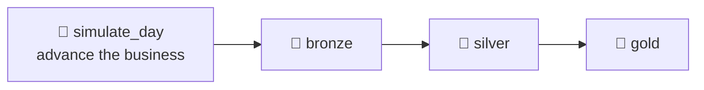

# 5.3 Schedule ingestion & Spark jobs

## Concept
ShopFlow is a *living* business: every day brings new orders, price changes, and late-arriving
records. A small generator, `simulate_day.py`, stands in for reality — it inserts a day's new
orders into Postgres for a given date. In production that new data would arrive on its own.

A daily pipeline therefore has **four** steps: advance the day, then run the Bronze → Silver →
Gold medallion from [5.2](medallion-dag.md).



Three ideas make a *scheduled* pipeline trustworthy:

- **Idempotency** — re-running a date must produce the same result, not duplicates. The
  Bronze/Silver/Gold jobs here **rebuild from source** with `createOrReplace`, so a re-run simply
  replaces the tables — inherently safe. (In production you'd optimise to *incremental*:
  partition-overwrite Bronze and `MERGE` Silver — the same `MERGE` from [2.6](../unit2/merge.md) /
  [4.3](../unit4/transform-silver.md). The orchestration is identical either way.)
- **Retries** — transient failures (a Postgres hiccup) should self-heal before paging anyone.
- **Catchup / backfill** — if the scheduler was down for three days, Airflow can run the missed
  dates in order; and you can deliberately re-run a historical range.

## Lab

### 1. Add a daily schedule + retries
Create `code/airflow/dags/shopflow_daily.py`. The generator runs first, using the run's business
date (`{{ ds }}`); then the medallion rebuilds so the new day is included.

```python
from airflow.sdk import DAG
from airflow.providers.standard.operators.bash import BashOperator
from datetime import timedelta
import pendulum

JOBS = "/code/shared/jobs"
SPARK_MASTER = "spark://spark-master:7077"

def spark_job(script: str) -> str:
    return (
        f"spark-submit --master {SPARK_MASTER} "
        "--conf spark.sql.catalogImplementation=in-memory "
        "--conf spark.cores.max=2 "
        f"{JOBS}/{script} --catalog iceberg"
    )

default_args = {
    "retries": 2,
    "retry_delay": timedelta(minutes=2),   # wait, then try again
}

with DAG(
    dag_id="shopflow_daily",
    description="Daily: simulate a day, then rebuild Bronze→Silver→Gold",
    schedule="0 6 * * *",                  # every day at 06:00 UTC
    start_date=pendulum.datetime(2026, 9, 1, tz="UTC"),
    catchup=False,                         # don't backfill history on first deploy
    max_active_runs=1,                     # one day at a time — avoids overlap
    default_args=default_args,
    tags=["unit5", "daily"],
) as dag:

    simulate = BashOperator(
        task_id="simulate_day",
        bash_command="python " + JOBS + "/simulate_day.py --date {{ ds }}",
    )
    bronze = BashOperator(task_id="bronze", bash_command=spark_job("ingest_bronze.py"))
    silver = BashOperator(task_id="silver", bash_command=spark_job("build_silver.py"))
    gold   = BashOperator(task_id="gold",   bash_command=spark_job("build_gold.py"))

    simulate >> bronze >> silver >> gold
```

- `schedule="0 6 * * *"` is a cron string (min hour day month weekday); the alias `@daily` also works.
- `retries` + `retry_delay` in `default_args` apply to every task.
- `max_active_runs=1` keeps days from overlapping.

!!! warning "`{{ ds }}` needs a *dated* run"
    `{{ ds }}` (the business date) only exists for **scheduled** and **backfill** runs — those
    carry a logical date. A plain manual **▶ Trigger** in Airflow 3 has *no* logical date, so
    `simulate_day` would fail with `'ds' is undefined`. To run a specific date on demand, use a
    **backfill** (below) or let the schedule fire.

### 2. Run dates on demand — from the UI
Everything is done in the browser. In the DAGs list, toggle **shopflow_daily** **on** (unpause)
so the scheduler runs it automatically at 06:00. To run specific dates *now* without waiting, use
**Backfill** — Airflow 3 runs backfills straight from the UI: open the **shopflow_daily** page,
choose the **Backfill** action, pick a start and end date, and run it. Each date becomes a run
*in order*, each with its own `{{ ds }}`.

In **Grid** view each column is one business day; a backfill fills several columns left to right.
`simulate_day` adds that day's orders, then Bronze/Silver/Gold rebuild to include it. Confirm in
the Trino CLI or Superset:

```sql
-- via Trino (Unit 2) — the new days now appear in Gold
SELECT * FROM iceberg.gold.daily_sales ORDER BY order_date DESC LIMIT 5;
```

### 3. A note on sensors & alerts
- **Sensors** wait for a condition before proceeding — e.g. an `S3KeySensor` (from the
  `apache-airflow-providers-amazon` provider) that blocks Bronze until the day's file lands. Prefer
  `mode="reschedule"` so a waiting sensor frees its worker slot.
- **Alerts** — set `on_failure_callback` (or an email/Slack callback in `default_args`) so a failed
  ShopFlow run notifies you instead of failing silently.

## Challenge
Run a **3-day backfill**, then confirm the new business day(s) landed in Gold. (This exercises
**catchup/backfill** — running a range of dates in order.)

??? note "Solution"
    On the **shopflow_daily** page open the **Backfill** action, set the range
    **2026-09-01 → 2026-09-03**, and run it — Airflow creates one run per date, in order (watch
    them fill Grid view). Then verify — the **newest** days in Gold now include the simulated
    business day(s):
    ```sql
    SELECT order_date, orders, revenue
    FROM iceberg.gold.daily_sales
    ORDER BY order_date DESC
    LIMIT 5;
    ```
    (Which exact `order_date`s appear depends on Airflow's **data-interval** semantics — `{{ ds }}`
    is the *start* of each run's interval — so read the newest rows rather than assuming specific
    dates.) Each backfill run is idempotent for Bronze/Silver/Gold (they `createOrReplace`); note
    that `simulate_day` *appends* new orders — it represents fresh real-world data, so re-running a
    date deliberately adds more activity.

!!! tip "🎯 The same scheduling on Azure, Databricks, Snowflake & Fabric"
    **What you just did:** added a daily cron schedule, per-task retries, and catchup/backfill.

    - **Azure Data Factory** — a **Schedule trigger** for the daily run and a **Tumbling Window
      trigger** for windowed backfill/catchup; retries are a per-activity policy; a file-arrival
      **Storage-event trigger** is the managed version of a sensor.
    - **Azure Databricks** — **Workflows/Jobs** with schedules, file-arrival triggers, per-task
      retries, and alerts built in.
    - **Snowflake** — a scheduled **Task** (`SCHEDULE` cron) with retries; **Streams** act as
      change-sensors driving idempotent incrementals.
    - **Microsoft Fabric** — **Data Factory in Fabric** pipeline scheduling with the same trigger
      and retry model.

    Backfill and idempotent re-runs are best practice everywhere — and **managed Airflow** (MWAA,
    ADF Managed Airflow, Cloud Composer) runs this DAG unchanged.

## Key terms, at a glance
| Term | Plain meaning |
|---|---|
| **Schedule (cron / `@daily`)** | When the DAG runs automatically |
| **`{{ ds }}`** | The run's business date — set for scheduled/backfill runs |
| **Idempotency** | Re-running a date replaces, never duplicates |
| **Retries / `retry_delay`** | Auto-recover from transient failures |
| **`max_active_runs`** | Cap concurrent DAG runs (avoid overlap) |
| **Catchup / backfill** | Run missed or historical dates, in order |
| **Sensor** | A task that waits for a condition (file arrival, etc.) |

## You can now…
- Schedule a daily pipeline that advances the business, then rebuilds the medallion
- Make re-runs safe with idempotent jobs, retries, and `max_active_runs`
- Use **backfill** to run historical dates in order (each with its own `{{ ds }}`)
- Know where sensors and alerts fit for a robust production pipeline
