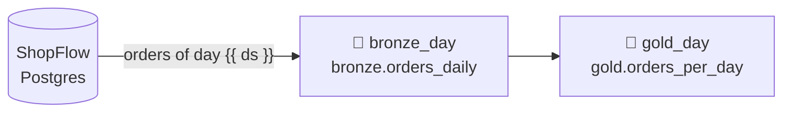

# 5.3 Schedule ingestion & Spark jobs

## Concept
ShopFlow is a *living* business: every day brings new orders. A real pipeline doesn't reload all
of history every time — it runs **once a day** and loads **that day's** data. ShopFlow's order
history (June 2023 – May 2025) lets you practise exactly that: each run of today's DAG loads the
orders of **one business day** into your lakehouse.


```mermaid
flowchart LR
  PG[("ShopFlow<br/>Postgres")] -->|"orders of day {{ ds }}"| B["🥉 bronze_day<br/>bronze.orders_daily"]
  B --> G["🥇 gold_day<br/>gold.orders_per_day"]
```

A *scheduled* pipeline runs itself on a clock — and once it does, three new questions appear: what
happens if the same date runs **twice**? what happens when a step **fails**? and how do you fill in
dates the scheduler **missed**? Three ideas answer them:

- **Idempotency** — re-running a date must produce the same result, not duplicates. "Idempotent"
  means an operation lands in the same final state no matter how many times you apply it. Here,
  Bronze **overwrites only that day's partition** and Gold **`MERGE`s** that day's row (update if it
  exists, insert if not) — so a re-run simply replaces the day.
- **Retries** — transient failures (a Postgres hiccup) should self-heal before paging anyone.
  Airflow can re-run a failed task a few times, waiting between attempts, before it gives up.
- **Catchup / backfill** — if the scheduler was down for three days, Airflow can run the missed
  dates in order; and you can deliberately run a historical range. Both mean the same mechanic:
  every *date* is its own run, executed one at a time.

!!! info "New vocabulary in this lesson"
    This lesson introduces the words that turn a DAG into a *scheduled* pipeline: a **schedule
    interval** (a cron string like `0 6 * * *`, or a preset like `@daily`), a **`start_date`**,
    **`catchup`**/**backfill**, **`retries`**, **partition overwrite**, and **templating** with
    **`{{ ds }}`** (the run's business date). Each is explained the first time it appears below,
    and all are collected in *Key terms* at the end.

## Lab

### 1. A daily DAG with retries
In Jupyter's **`dags/`** folder create **`daily.py`**. Each run loads one day — the run's business
date, which the tasks receive as **`ds`** — into Bronze, then refreshes that day in Gold.

```python
from datetime import timedelta

import pendulum
from airflow.sdk import dag, task

PG = {"url": "jdbc:postgresql://postgres:5432/shopflow", "user": "learner",
      "password": "learner", "driver": "org.postgresql.Driver"}


@dag(
    dag_id="demouser_daily",              # own account? use your username instead of demouser
    description="Daily: load one day's orders into Bronze, refresh that day in Gold",
    schedule="0 6 * * *",                 # every day at 06:00 UTC
    start_date=pendulum.datetime(2024, 1, 1, tz="UTC"),
    catchup=False,                        # don't replay history when you switch it on
    max_active_runs=1,                    # one day at a time
    default_args={"retries": 2, "retry_delay": timedelta(minutes=2)},
    tags=["unit5", "daily"],
)
def daily():

    @task
    def bronze_day(ds=None):
        """Orders of ONE day (ds) → bronze.orders_daily, replacing only that day's partition."""
        from lab_spark import lab_spark
        spark = lab_spark()
        day = (spark.read.format("jdbc").options(**PG)
               .option("query", f"SELECT *, order_ts::date AS order_date FROM orders "
                                f"WHERE order_ts::date = DATE '{ds}'")
               .load())
        spark.sql("""CREATE TABLE IF NOT EXISTS iceberg.bronze.orders_daily (
                       order_id INT, customer_id INT, channel STRING, order_ts TIMESTAMP,
                       status STRING, currency STRING, promo_id INT, order_date DATE)
                     USING iceberg PARTITIONED BY (order_date)""")
        day.writeTo("iceberg.bronze.orders_daily").overwritePartitions()
        print(f"{ds}: {day.count()} orders loaded")

    @task
    def gold_day(ds=None):
        """Recompute that day's row in gold.orders_per_day (MERGE = insert or update)."""
        from lab_spark import lab_spark
        spark = lab_spark()
        spark.sql("""CREATE TABLE IF NOT EXISTS iceberg.gold.orders_per_day (
                       order_date DATE, orders BIGINT, delivered BIGINT) USING iceberg""")
        spark.sql(f"""
            MERGE INTO iceberg.gold.orders_per_day t
            USING (SELECT order_date, count(*) AS orders,
                          count_if(status = 'delivered') AS delivered
                   FROM iceberg.bronze.orders_daily
                   WHERE order_date = DATE '{ds}'
                   GROUP BY order_date) s
            ON t.order_date = s.order_date
            WHEN MATCHED THEN UPDATE SET *
            WHEN NOT MATCHED THEN INSERT *""")
        print(spark.table("iceberg.gold.orders_per_day").where(f"order_date = DATE '{ds}'").collect())

    bronze_day() >> gold_day()


daily()
```

**Read it step by step:**

- **`schedule="0 6 * * *"`** — the **schedule interval**: how often the DAG fires, as a **cron
  string** with five fields — `minute hour day-of-month month day-of-week`. `0 6 * * *` reads
  "minute 0, hour 6, any day" → **every day at 06:00 UTC**. The preset **`@daily`** means midnight.
- **`start_date=pendulum.datetime(2024, 1, 1, tz="UTC")`** — the first business date the schedule
  may produce a run for. (ShopFlow's history covers 2023-06 → 2025-05, so 2024 dates have data.)
- **`catchup=False`** — when you switch the DAG on, *don't* immediately run every date since
  `start_date` (that would be hundreds of runs). You'll run history deliberately with a
  **backfill** in step 2.
- **`max_active_runs=1`** — one date at a time, so runs never write the same tables at once.
- **`default_args={"retries": 2, "retry_delay": timedelta(minutes=2)}`** — applied to *every*
  task: a failed task is re-run up to two more times, two minutes apart, before it's marked failed.
- **`def bronze_day(ds=None)`** — a task can ask for run information by **parameter name**:
  Airflow fills in **`ds`**, the run's **logical (business) date** as `YYYY-MM-DD`. The Jinja form of
  the same value is **`{{ ds }}`** (for `bash_command`s and other templated fields).
- **`.option("query", "… WHERE order_ts::date = DATE '{ds}'")`** — read **only that day's orders**
  from Postgres (JDBC with a query instead of a whole table).
- **`CREATE TABLE IF NOT EXISTS … PARTITIONED BY (order_date)`** — the first run creates the table,
  split into one **partition** per day; later runs skip this.
- **`.writeTo(…).overwritePartitions()`** — **replace only the partitions present in this data** —
  here, that one day. Other days stay untouched. Run the same date twice → same result: **idempotent**.
- **`MERGE INTO … ON t.order_date = s.order_date`** — Gold keeps one row per day: **update** it if the
  day is already there, **insert** it if not ([2.8](../unit2/merge.md)). Also idempotent.

!!! warning "`ds` needs a *dated* run"
    `ds` (the business date) only exists for **scheduled** and **backfill** runs. A plain
    **▶ Trigger** in Airflow 3 has no logical date, so `ds` is empty and the query fails. To run
    specific dates now, use a **backfill** (next step).

### 2. Run dates on demand — backfill
Toggle **demouser_daily** **on** (unpause): from now on the scheduler runs it every morning at
06:00. To run specific past dates *now*, open the **demouser_daily** page → **Backfill**: pick
**2024-01-01** to **2024-01-04**, set **max active runs** to **1**, and run it. Airflow creates one
run per date and executes them **in order**, each with its own `ds` (Jan 1, 2 and 3 — the end date
itself isn't included).

!!! tip "Why *max active runs = 1*"
    A backfill can run several dates at the same time. On a brand-new table, two dates starting at
    the same moment both try to create it — one at a time avoids that race (it's also what
    `max_active_runs=1` in the DAG says for scheduled runs).

In **Grid** view each column is one business day; the backfill fills them left to right. Then
check your lakehouse:

```sql
%%sql
SELECT * FROM iceberg.gold.orders_per_day ORDER BY order_date
```

**Read it step by step:** one row per loaded day — `2024-01-01` with 50 orders (36 delivered),
`2024-01-02` with 55, `2024-01-03` with 53. Run the same backfill again: the rows **don't
double** — Bronze replaced each day's partition and Gold merged each day's row. That's idempotency.

### 3. A note on sensors & alerts
- **Sensors** wait for a condition before proceeding — e.g. an `S3KeySensor` (from the
  `apache-airflow-providers-amazon` provider) that blocks Bronze until the day's file lands. Prefer
  `mode="reschedule"` so a waiting sensor frees its worker slot.
- **Alerts** — set `on_failure_callback` (or an email/Slack callback in `default_args`) so a failed
  ShopFlow run notifies you instead of failing silently.

## Challenge
Backfill the **whole of January 2024**, then answer: which day of the month had the most orders?
(This exercises **backfill** over a longer range — and proves your pipeline is idempotent, because
January 1–3 run a second time.)

??? note "Solution"
    On the **demouser_daily** page open **Backfill**, range **2024-01-01 → 2024-02-01**, max active
    runs **1**. When the 31 runs are green:
    ```sql
    %%sql
    SELECT order_date, orders, delivered
    FROM iceberg.gold.orders_per_day
    WHERE order_date BETWEEN DATE '2024-01-01' AND DATE '2024-01-31'
    ORDER BY orders DESC
    LIMIT 3
    ```
    Check `SELECT count(*) FROM iceberg.gold.orders_per_day` too: **31** rows, not 34 — Jan 1–3
    were *replaced*, not duplicated.

!!! tip "🎯 The same scheduling on Azure, Databricks, Snowflake & Fabric"
    **What you just did:** added a daily cron schedule, per-task retries, and catchup/backfill.

    - **Azure Data Factory** — a **Schedule trigger** for the daily run and a **Tumbling Window
      trigger** for windowed backfill/catchup; retries are a per-activity policy; a file-arrival
      **Storage-event trigger** is the managed version of a sensor.
    - **Azure Databricks** — **Workflows/Jobs** with schedules, file-arrival triggers, per-task
      retries, and alerts built in.
    - **Snowflake** — a scheduled **Task** (`SCHEDULE` cron) with retries; **Streams** act as
      change-sensors driving idempotent incrementals.
    - **Microsoft Fabric** — **Data Factory in Fabric** pipeline scheduling with the same trigger
      and retry model.

    Backfill and idempotent re-runs are best practice everywhere — and **managed Airflow** (MWAA,
    ADF Managed Airflow, Cloud Composer) runs this DAG unchanged.

## Key terms, at a glance
| Term | Plain meaning |
|---|---|
| **Schedule interval** | How often a DAG fires automatically |
| **Cron string** | Five fields `min hour day month weekday` (e.g. `0 6 * * *` = 06:00 daily) |
| **`@daily`** | Preset alias for the once-a-day cron `0 0 * * *` |
| **`start_date`** | First date the schedule may produce a run for |
| **`catchup`** | On deploy, replay every interval since `start_date` (`False` = don't) |
| **Backfill** | Deliberately run a range of past dates, one per date, in order |
| **`{{ ds }}`** | Templated **logical/business date** of the run — set for scheduled/backfill runs only |
| **`{{ run_id }}`** | Templated unique identifier for the run |
| **Templating / macro** | Jinja `{{ ... }}` filled in per run just before a task executes |
| **`retries` / `retry_delay`** | Re-run a failed task N times, waiting between attempts |
| **`ds` parameter** | A task argument Airflow fills with the run's business date |
| **Partition overwrite** | `overwritePartitions()` — replace only the partitions present in the data |
| **`>>` (dependency)** | "then" — sets task run order (`a >> b` = a before b) |
| **Idempotent** | Re-running a date replaces its partition / row — same result, no duplicates |
| **`max_active_runs`** | Cap concurrent DAG runs (avoid overlap) |
| **Sensor** | A task that waits for a condition (file arrival, etc.) |

## You can now…
- Schedule a daily pipeline that loads one business day per run (`ds`)
- Make re-runs safe with partition overwrite, `MERGE`, retries, and `max_active_runs`
- Use **backfill** to run historical dates in order (each with its own `{{ ds }}`)
- Know where sensors and alerts fit for a robust production pipeline
