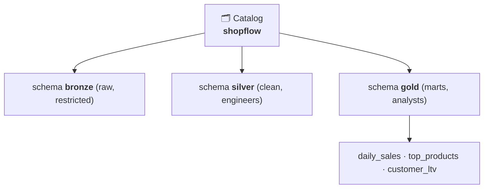

# 6.1 Catalogs, schemas, tables

## Concept
The lakehouse you built in [Unit 4](../unit4/spark-sql-gold.md) lives in the **`iceberg`** catalog
— open to anyone who can reach Trino or Spark. That's fine for one learner in a sandbox, but a
real company needs to answer: *what data exists, who owns it, what do the columns mean, and who is
allowed to read it?* That's the job of a **governed catalog** — and the open-source one on this
stack is **Unity Catalog** (the OSS edition of Databricks' own).

### What is Unity Catalog?
**Unity Catalog** is the **governance layer** you first met in
[Unit 1.2](../unit1/lakehouse.md)/[1.4](../unit1/medallion.md)
— a single service that keeps a *directory of all your data* plus the rules for who may touch it.
Think of it as the "table of contents" and the "security desk" for the whole lakehouse, sitting
*above* the storage and the query engines. It doesn't hold the rows itself; it holds the **metadata**
(names, owners, column meanings) and the **access policy**, and points at where the data actually
lives. The version on this stack is the open-source edition of the same product Databricks ships in
the cloud, so everything you learn here transfers 1:1.

Unity Catalog organises everything into a **3-level namespace** — a governed "directory of data"
with three tiers you always write dotted together, left to right:

```
catalog . schema . table
shopflow . gold   . daily_sales
```

!!! info "Reading the 3-level namespace"
    A **namespace** is just a naming scheme that guarantees every table has one unique full address.
    Read `shopflow.gold.daily_sales` like a file path — **`shopflow`** is the top folder (the
    *catalog*), **`gold`** is a sub-folder inside it (the *schema*), and **`daily_sales`** is the
    dataset (the *table*). Two tables can both be called `daily_sales` as long as they live in
    different schemas, exactly like two files with the same name in different folders.



- **Catalog** — the top-level container for a whole domain or data product. Ours is `shopflow`.
  You *create* it once and everything for that product lives inside.
- **Schema** — a named group of related tables inside a catalog. We use **one schema per medallion
  layer** (`bronze`, `silver`, `gold`), so the folder structure mirrors the data's maturity.
- **Table** — a single registered dataset: columns, their types, an owner, and a pointer to where
  the data physically sits. This is the leaf of the tree — the thing you actually query.

!!! warning "A Trino catalog (Unit 2) is *not* a Unity Catalog catalog"
    You already used the word "catalog" in [Unit 2](../unit2/intro.md), and it means something
    different there. A **Trino catalog** is a *connection* — a config file telling the query engine
    "here's how to reach this database." A **Unity Catalog catalog** is a *governed container* you
    deliberately create to hold schemas and tables, with owners and access rules attached. One is
    plumbing (how to connect); the other is governance (what exists and who may see it). Same word,
    two jobs — this lesson is entirely about the second kind.

!!! abstract "How this fits the lakehouse you built"
    Two catalogs, two jobs. **`iceberg`** (Trino/Spark) is where you *build and query* the
    lakehouse — open access. **`shopflow`** in Unity Catalog is where you *govern* it — names,
    ownership, and access policy. On **Databricks** these are one and the same (Unity Catalog both
    stores and enforces); this OSS stack keeps them separate, which is why we treat governance as
    its own layer here. The **model** you learn is identical.

## Lab
The governed `shopflow` catalog is **pre-provisioned** on your stack (an admin runs `make uc-seed`
once — catalog creation is admin-only in UC OSS). Your job is to **browse and inspect** it — all
container-free.

### Get a per-user token (container-free)
Unity Catalog won't answer questions from just anyone — every request must carry proof of *who is
asking*. That proof is an **auth token**: a short string that says "this is the analyst user, and
Keycloak vouches for them." `login.sh` handles the whole handshake — it logs you in to Keycloak
(the identity provider from Unit 1) with a username and password, and prints back the token — so you
never have to `docker exec` into a container.

```bash
export UC=http://localhost:8081
export UC_URL=$UC
export KC_URL=http://keycloak:8080/realms/de-stack/protocol/openid-connect/token
# (compose needs `127.0.0.1 keycloak` in /etc/hosts — a stack prerequisite)

T=$(common/uc-cli/login.sh analyst)      # logs in as analyst / analyst
```

**Read it step by step:**

- **`export UC=http://localhost:8081`** — the address of the Unity Catalog server. Every `uc`
  command below points at this with `--server`, so we save it in a variable once.
- **`export UC_URL=$UC`** — the same address under the name `login.sh` expects; `$UC` reuses the
  value we just set.
- **`export KC_URL=…/token`** — where to log in: the Keycloak token endpoint for the `de-stack`
  realm. This is the door `login.sh` knocks on to trade a password for a token.
- **`T=$(common/uc-cli/login.sh analyst)`** — run the login helper as the **`analyst`** user
  (password also `analyst`) and capture the token it prints into the variable **`T`**. From here on,
  `"$T"` is your identity badge — you pass it to every `uc` call.

!!! note "Why a per-user token, not a shared admin login?"
    The token carries *your* identity, so Unity Catalog can enforce **per-user** rules — the analyst
    sees the analyst's data, an engineer sees more. Log in as a different user and you'd get a
    different token that unlocks different things. You'll use exactly this in [6.2](rbac.md) to see
    access control in action.

### Explore the namespace with the `uc` CLI
The **`uc` CLI** is the command-line client for Unity Catalog. Every call follows the same shape:
`uc --server <address> --auth_token <badge> <object> <verb> [options]`. The `--server` flag says
*which* catalog server to talk to (our `$UC`), and `--auth_token` presents your identity badge
(`"$T"`) so the server knows who's asking. Then you name an **object** (`catalog`, `schema`,
`table`) and a **verb** (`list`, `get`) — you're walking the namespace one level at a time.

```bash
# What catalogs exist?
uc --server $UC --auth_token "$T" catalog list          # includes: shopflow

# The medallion schemas inside shopflow
uc --server $UC --auth_token "$T" schema list --catalog shopflow   # bronze, silver, gold

# Inspect a securable's details
uc --server $UC --auth_token "$T" schema get --full_name shopflow.gold
```

**Read it step by step:**

- **`catalog list`** — ask the server for every catalog you're allowed to see. This is the top of
  the tree; `shopflow` (our governed catalog) shows up in the list.
- **`schema list --catalog shopflow`** — drop one level down and list the schemas *inside*
  `shopflow`. The **`--catalog`** option scopes the question to that one catalog, so you get back the
  three medallion layers: `bronze`, `silver`, `gold`.
- **`schema get --full_name shopflow.gold`** — instead of listing, fetch the *details* of one
  object. **`get`** returns metadata (owner, comment, timestamps) for a single **securable** named
  by its **`--full_name`** — the full dotted address `shopflow.gold`.

!!! info "`list` vs `get`, and how table commands work"
    Two verbs, two jobs: **`list`** enumerates the children of a container (many objects, names
    only), while **`get`** zooms into one object (all its metadata). The table level follows the
    exact same pattern — `uc … table list --catalog shopflow --schema gold` enumerates the tables in
    `gold`, and `uc … table get --full_name shopflow.gold.daily_sales` pulls one table's columns and
    types. Same grammar, one level deeper.

!!! tip "Notice: no SQL, no container shell"
    You browsed the entire data landscape — catalogs, schemas, a schema's details — without writing a
    single `SELECT` or opening a shell inside any container. That's the point of a catalog: it's a
    **discovery** surface. You find *what* exists and *who owns it* here; you query the actual rows
    with Trino or Spark elsewhere.

### Explore it in the Web UI
Open the Unity Catalog Web UI at <http://localhost:3000> and sign in as **`analyst` / `analyst`**
(Keycloak SSO). Click `shopflow` → `gold` to see the same 3-level tree, column metadata, and
ownership — a self-service map of the lakehouse. *(The browser SSO redirect needs the
`127.0.0.1 keycloak` hosts entry.)*

!!! info "How enforcement works on this stack"
    UC stores the **namespace + policy** (which you browse here) **and enforces it at query time via
    Spark** — reading the governed `lakehouse` catalog through UC gates each persona (see
    [6.8](governed-spark.md)). **Trino** reads the open `iceberg` catalog (full access) for SQL/BI.
    So: **Spark = governed, Trino = full access** — the same split as industry. On **Databricks**
    *every* engine reads through UC; here Spark does, and the governance model transfers 1:1.

## Challenge
Answer, entirely by browsing the catalog (CLI or UI): **which schemas does `shopflow` contain, and
which one is meant for analysts?**

??? note "Solution"
    ```bash
    uc --server $UC --auth_token "$T" schema list --catalog shopflow
    #  -> bronze, silver, gold
    ```
    `gold` is the analyst layer (business-ready marts); `silver` is for engineers; `bronze` is
    restricted. You'll see exactly who can reach each in [6.2](rbac.md).

!!! tip "🎯 This IS the OSS edition of Databricks Unity Catalog"
    **What you just did:** browsed the `catalog.schema.table` namespace of a governed catalog.

    - **Azure Databricks** — *identical*: this is Unity Catalog. The same 3-level namespace and the
      same objects — only the container becomes a managed regional metastore, and the engines
      enforce it automatically.
    - **Snowflake** — the same shape as `database.schema.table`.
    - **Microsoft Fabric** — a **Workspace + Lakehouse**, catalogued with **Microsoft Purview**.
    - **Azure Data Factory** — has no catalog of its own; governance lives in UC or Purview.

    The three-level "container → folder → dataset" model is universal, and portable 1:1 to Databricks.

## Key terms, at a glance
| Term | Plain meaning |
|---|---|
| **Unity Catalog** | The governance layer — one service holding the data directory + access policy |
| **Governed catalog** | A named, access-controlled layer over the lake |
| **Catalog** | Top-level container for a domain/product (ours: `shopflow`) |
| **Schema** | A named group of tables inside a catalog (ours: one per medallion layer) |
| **Table** | A registered dataset — columns, types, owner, and a pointer to the data |
| **Namespace** | The 3-level naming scheme `catalog.schema.table` — every table's unique address |
| **Metastore** | The store behind UC that holds all this metadata (managed & regional on Databricks) |
| **`uc` CLI** | Command-line client for UC: `uc --server … --auth_token … <object> <verb>` |
| **Auth token** | Your identity badge from Keycloak, passed via `--auth_token` on every call |
| **Securable** | Any object you can govern (catalog, schema, table) |
| **`login.sh`** | Container-free Keycloak login → a UC token |
| **UC web UI** | Browse-and-discover surface (localhost:3000) |

## You can now…
- Explain the 3-level namespace and why a governed catalog beats a bare lake
- Get a per-user UC token container-free and browse catalogs/schemas with the `uc` CLI + web UI
- Describe how the `iceberg` build catalog and the `shopflow` governance catalog relate
