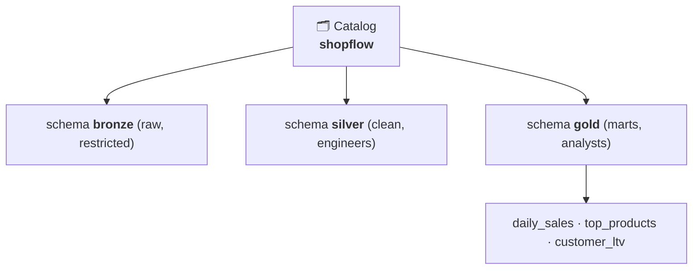

# 6.1 Catalogs, schemas, tables

## Concept
The lakehouse you built in [Unit 4](../unit4/spark-sql-gold.md) lives in the **`iceberg`** catalog
— open to anyone who can reach Trino or Spark. That's fine for one learner in a sandbox, but a
real company needs to answer: *what data exists, who owns it, what do the columns mean, and who is
allowed to read it?* That's the job of a **governed catalog** — and the open-source one on this
stack is **Unity Catalog** (the OSS edition of Databricks' own).

Unity Catalog organises everything into a **3-level namespace**:

```
catalog . schema . table
shopflow . gold   . daily_sales
```



- **Catalog** — top-level container for a domain/product. Ours is `shopflow`.
- **Schema** — a group of related tables; we use one per medallion layer.
- **Table** — a registered dataset with columns, types, and a location.

!!! abstract "How this fits the lakehouse you built"
    Two catalogs, two jobs. **`iceberg`** (Trino/Spark) is where you *build and query* the
    lakehouse — open access. **`shopflow`** in Unity Catalog is where you *govern* it — names,
    ownership, and access policy. On **Databricks** these are one and the same (Unity Catalog both
    stores and enforces); this OSS stack keeps them separate, which is why we treat governance as
    its own layer here. The **model** you learn is identical.

## Lab
The governed `shopflow` catalog is **pre-provisioned** on your stack (an admin runs `make uc-seed`
once — catalog creation is admin-only in UC OSS). Your job is to **browse and inspect** it — all
container-free.

### Get a per-user token (container-free)
`login.sh` does a Keycloak password login and prints a Unity Catalog token — no shell into any
container:

```bash
export UC=http://localhost:8081
export UC_URL=$UC
export KC_URL=http://keycloak:8080/realms/de-stack/protocol/openid-connect/token
# (compose needs `127.0.0.1 keycloak` in /etc/hosts — a stack prerequisite)

T=$(common/uc-cli/login.sh analyst)      # logs in as analyst / analyst
```

### Explore the namespace with the `uc` CLI

```bash
# What catalogs exist?
uc --server $UC --auth_token "$T" catalog list          # includes: shopflow

# The medallion schemas inside shopflow
uc --server $UC --auth_token "$T" schema list --catalog shopflow   # bronze, silver, gold

# Inspect a securable's details
uc --server $UC --auth_token "$T" schema get --full_name shopflow.gold
```

### Explore it in the Web UI
Open the Unity Catalog Web UI at <http://localhost:3000> and sign in as **`analyst` / `analyst`**
(Keycloak SSO). Click `shopflow` → `gold` to see the same 3-level tree, column metadata, and
ownership — a self-service map of the lakehouse. *(The browser SSO redirect needs the
`127.0.0.1 keycloak` hosts entry.)*

!!! warning "Honest limits on this OSS stack"
    On **Databricks Unity Catalog** the query engines read table data straight from the catalog and
    enforce its policies. On this OSS compose stack, UC stores the **namespace and policy** (which
    you browse here), but wiring the engines to *read UC tables and enforce grants* needs extra
    pieces (Delta + a Trino UC connector) that aren't installed — so we learn the governance
    **model** here, and it transfers 1:1 to the managed cloud where enforcement is automatic.

## Challenge
Answer, entirely by browsing the catalog (CLI or UI): **which schemas does `shopflow` contain, and
which one is meant for analysts?**

??? note "Solution"
    ```bash
    uc --server $UC --auth_token "$T" schema list --catalog shopflow
    #  -> bronze, silver, gold
    ```
    `gold` is the analyst layer (business-ready marts); `silver` is for engineers; `bronze` is
    restricted. You'll see exactly who can reach each in [6.2](rbac.md).

!!! tip "🎯 This IS the OSS edition of Databricks Unity Catalog"
    **What you just did:** browsed the `catalog.schema.table` namespace of a governed catalog.

    - **Azure Databricks** — *identical*: this is Unity Catalog. The same 3-level namespace and the
      same objects — only the container becomes a managed regional metastore, and the engines
      enforce it automatically.
    - **Snowflake** — the same shape as `database.schema.table`.
    - **Microsoft Fabric** — a **Workspace + Lakehouse**, catalogued with **Microsoft Purview**.
    - **Azure Data Factory** — has no catalog of its own; governance lives in UC or Purview.

    The three-level "container → folder → dataset" model is universal, and portable 1:1 to Databricks.

## Key terms, at a glance
| Term | Plain meaning |
|---|---|
| **Governed catalog** | A named, access-controlled layer over the lake |
| **Catalog / schema / table** | The 3-level namespace (`catalog.schema.table`) |
| **Securable** | Any object you can govern (catalog, schema, table) |
| **`login.sh`** | Container-free Keycloak login → a UC token |
| **UC web UI** | Browse-and-discover surface (localhost:3000) |

## You can now…
- Explain the 3-level namespace and why a governed catalog beats a bare lake
- Get a per-user UC token container-free and browse catalogs/schemas with the `uc` CLI + web UI
- Describe how the `iceberg` build catalog and the `shopflow` governance catalog relate
