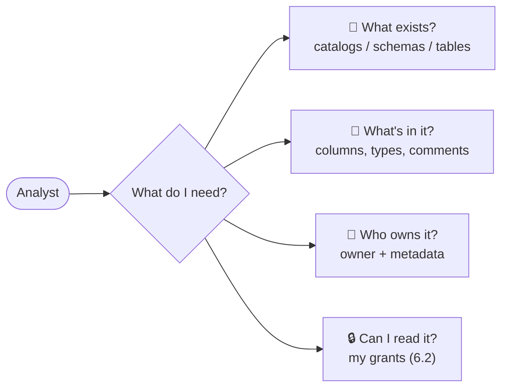

# 6.3 Discovery & search

## Concept
You've built the pipeline ([Unit 4](../unit4/spark-sql-gold.md)), scheduled it
([Unit 5](../unit5/basics.md)), and defined an access policy ([6.2](rbac.md)). The last job of a
catalog is **discovery**: letting people *find* trustworthy data themselves instead of pinging the
data team on Slack. A governed catalog turns *"where is the orders data and can I trust it?"* into
a two-minute self-service browse.

Good discovery answers four questions for every dataset:



Discovery and governance are two sides of one coin: the catalog is the single place that records
*what exists* **and** *who may see it*.

## Lab

### Browse in the Web UI
Open the Unity Catalog Web UI at <http://localhost:3000> and sign in as **`analyst` / `analyst`**
(Keycloak SSO; the browser redirect needs `127.0.0.1 keycloak` in `/etc/hosts`).

1. Click **`shopflow`** → the schemas `bronze`, `silver`, `gold`.
2. Open **`gold`** → its marts.
3. Click a table → inspect the **columns**, **owner**, and **metadata**.

### Discover from the CLI (container-free)
The same discovery works headless — handy for scripting a data inventory. Use the token from
[6.1](catalogs.md) (`login.sh`, no container shell):

```bash
export UC=http://localhost:8081 UC_URL=http://localhost:8081
export KC_URL=http://keycloak:8080/realms/de-stack/protocol/openid-connect/token
T=$(common/uc-cli/login.sh analyst)

# What catalogs exist? Then drill in.
uc --server $UC --auth_token "$T" catalog list
uc --server $UC --auth_token "$T" schema  list --catalog shopflow
uc --server $UC --auth_token "$T" schema  get  --full_name shopflow.gold
```

!!! note "Discovery and grants — model vs OSS"
    On **Databricks Unity Catalog**, discovery is *filtered by your grants* — you only see what
    you're allowed to, so browsing is safe to open to the whole company. This OSS edition doesn't
    filter listings that way yet, so treat the grant policy from [6.2](rbac.md) as the source of
    truth for *who may read what*. The **principle** — discovery is trustworthy because governance
    travels with the metadata — is what transfers to the cloud.

## Challenge
An analyst asks: *"Which `shopflow` schema is for analysts, and how would I confirm it's the
governed layer?"* Answer it through discovery alone.

??? note "Solution"
    ```bash
    # 1. list the schemas
    uc --server $UC --auth_token "$T" schema list --catalog shopflow
    #    -> bronze, silver, gold   (gold = the analyst marts)

    # 2. confirm the access policy on it (from 6.2)
    uc --server $UC --auth_token "$T" permission get --securable_type schema --name shopflow.gold
    #    -> analyst: USE SCHEMA, SELECT
    ```
    Same path in the UI: `shopflow` → `gold` → read the column/owner panel. No Slack message
    required — that's the payoff of a governed catalog.

!!! tip "🎯 The same discovery on Azure, Databricks, Snowflake & Fabric"
    **What you just did:** browsed the catalog (UI + CLI) and inspected schema/table metadata.

    - **Azure Databricks** — *identical*: the browse surface is **Catalog Explorer** over the same
      Unity Catalog metadata, plus first-class **search, tags, and data lineage**.
    - **Snowflake** — the **Snowsight** object explorer + `INFORMATION_SCHEMA`; **Horizon** for
      catalog-wide search/governance.
    - **Microsoft Fabric** — the **OneLake data hub** for finding data, **Microsoft Purview** for
      catalog search, classification, and lineage.
    - **Azure Data Factory** — no catalog/discovery of its own; that surface lives in UC / Purview.

    Everywhere the principle holds: discovery is only trustworthy because governance backs it.

## Key terms, at a glance
| Term | Plain meaning |
|---|---|
| **Discovery** | Finding trustworthy data yourself via the catalog |
| **Metadata** | Columns, types, owner, comments recorded per table |
| **Self-service** | Browse without asking the data team |
| **Catalog Explorer** | Databricks' UC browse UI (this is its OSS cousin) |
| **Lineage** | Where data came from — a cloud UC/Purview feature |

## You can now…
- Browse catalogs → schemas → tables and inspect metadata (UI + CLI, container-free)
- Explain why a governed catalog enables safe, self-service discovery
- Tie discovery back to the access policy — the two halves of governance
