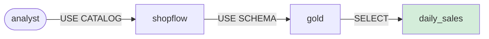

# 6.2 Users, roles & RBAC

## Concept
A catalog is only as trustworthy as its rules about **who can read what**. Unity Catalog uses
**role-based access control** — **RBAC** for short. RBAC just means access is decided by *rules you
write down* rather than by who happens to know a password. Every rule in this model has the same
shape, and it's worth memorising it as a single sentence:

> You **`GRANT`** a **privilege** on a **securable** to a **principal**.

Read that sentence right and the whole lesson follows. Here is what each of the four words means, in
plain terms:

- **Principal** — *who* is being granted. The identity on the receiving end: a user (or, on bigger
  platforms, a group). In this lesson our principals are the three personas, e.g.
  `analyst@dev-epireum.com`.
- **Securable** — *what* is being protected. The object the rule is about: a `catalog`, a `schema`,
  or a `table`. "Securable" is just UC's word for "a thing you can attach permissions to."
- **Privilege** — *what they may do* to that securable: `USE CATALOG`, `USE SCHEMA`, `SELECT`,
  `CREATE TABLE`. A privilege is a single named action, nothing more.
- **`GRANT`** — the *act* of handing a privilege to a principal. It's the verb of the whole model.
  (There's a matching `REVOKE` to take it back, though we don't need it here.)

!!! info "Why 'role-based'? The everyday analogy"
    Think of a building. A **principal** is a person, a **securable** is a room, and a **privilege**
    is what the door lets you do (open it, or just knock). `GRANT` is the moment the facilities team
    programs your badge. Nobody keeps a list of "Alice may enter" taped to every door — instead the
    badge system decides, centrally, room by room. UC is that badge system for your data.

The key idea — the one thing to take away from this page — is the **grant chain** (also called the
**grant hierarchy**). Access is *hierarchical*: a table lives *inside* a schema, which lives *inside*
a catalog, and to reach the table a principal needs permission at **every level above it**. `SELECT`
on the table means nothing if they can't even "enter" the catalog and schema that contain it. It's
the building again: the key to the filing cabinet is useless if you can't get through the front door
and into the room first.



Read the diagram left to right as three locked doors in a row: the analyst first needs `USE CATALOG`
to enter `shopflow`, then `USE SCHEMA` to enter `gold`, and only *then* does `SELECT` on
`daily_sales` actually return rows. Miss any one link and the chain breaks. Keep this picture in your
head — every grant you write below is just one arrow in a chain like this.

For ShopFlow we enforce the medallion access policy from [Unit 1](../unit1/medallion.md), mapped to
the three fixed [personas](../setup/personas.md):

| Persona | What they can do | Grants on `shopflow` |
|---|---|---|
| **analyst** | read the 🥇 Gold layer | `USE CATALOG` + Gold `USE SCHEMA` + `SELECT` |
| **engineer** | build in 🥈 Silver, read Gold | `USE CATALOG` + Silver `USE SCHEMA`/`SELECT`/`CREATE TABLE` + Gold `USE SCHEMA`/`SELECT` |
| **lead** | full access to every layer (owner) | `USE CATALOG` + `USE SCHEMA`/`SELECT`/`CREATE TABLE` on bronze **and** silver **and** gold |

🥉 **Bronze** raw data is granted to **lead** only — analyst and engineer are denied by default.

!!! tip "This table *is* least privilege"
    **Least privilege** is the guiding rule of all access control: give each principal *the fewest
    privileges they need to do their job, and nothing more*. Read the table with that lens and it
    tells a story — the **analyst** gets **Gold read only** (the clean, business-ready layer they
    actually report on); the **engineer** additionally gets **Silver** because that's the layer they
    *build*; the **lead** owns **everything**, Bronze included. Nobody is handed the raw Bronze feed
    "just in case." Every grant below exists because a persona provably needs it — that's the habit
    to build, because over-granting is how data leaks. Notice too that access is granted by *listing
    what's allowed*: anything not explicitly granted is **denied by default**, which is why Bronze
    stays locked to analyst and engineer without you writing a single "deny" rule.

This policy is **pre-provisioned** on your stack (`make uc-seed`). Below you'll read how it's
*defined*, then inspect it yourself.

## Lab

### How the policy is defined
Grants are written with the `uc` CLI (by an admin or the object's owner — an ordinary analyst can't
grant themselves access). Each grant is created with **`uc … permission create`**: the command that
*writes a new rule* into Unity Catalog. This is the exact chain that gives the **analyst** persona
read access to Gold — three rules, one per level of the hierarchy:

```bash
uc --server $UC --auth_token "$ADMIN" permission create \
  --securable_type catalog --name shopflow \
  --privilege "USE CATALOG" --principal analyst@dev-epireum.com

uc --server $UC --auth_token "$ADMIN" permission create \
  --securable_type schema --name shopflow.gold \
  --privilege "USE SCHEMA" --principal analyst@dev-epireum.com

uc --server $UC --auth_token "$ADMIN" permission create \
  --securable_type table --name shopflow.gold.daily_sales \
  --privilege "SELECT" --principal analyst@dev-epireum.com
```

**Read it step by step.** Every line is the same `permission create` command with four moving parts
— the flags map exactly onto the four words of the model:

- **`uc --server $UC --auth_token "$ADMIN"`** — call the `uc` CLI, pointing it at your Unity Catalog
  server (`$UC`) and authenticating as an **admin** (`$ADMIN` holds the admin's token). Only an
  admin or the object's owner is allowed to *hand out* privileges, so this is who does the granting.
- **`permission create`** — the sub-command that says "add a grant." (Its opposite, which we don't
  use here, would remove one.)
- **`--securable_type` + `--name`** — *which object* the rule protects (the **securable**).
  `catalog` / `shopflow`, then `schema` / `shopflow.gold`, then `table` /
  `shopflow.gold.daily_sales`. Notice the names get longer as we descend: a schema is named
  `catalog.schema`, a table `catalog.schema.table`.
- **`--privilege`** — *what action* is allowed (the **privilege**): `USE CATALOG`, then `USE SCHEMA`,
  then `SELECT`.
- **`--principal`** — *who* receives it (the **principal**): `analyst@dev-epireum.com` on all three.

Now look at the three commands together and you'll see the **grant chain** from the diagram, written
out one rule at a time:

1. **`USE CATALOG` on `shopflow`** — lets the analyst "enter" the catalog. On its own it reveals no
   data; it's the front-door badge.
2. **`USE SCHEMA` on `shopflow.gold`** — lets them "enter" the Gold schema. Still no rows — just the
   next door.
3. **`SELECT` on `shopflow.gold.daily_sales`** — *now* they can actually read the table.

Drop rule 1 or 2 and rule 3 is dead weight: without `USE CATALOG`/`USE SCHEMA` the analyst can't
even see the schema the table lives in, so the `SELECT` never gets a chance to fire. That's the grant
chain in action — **every level above the table must be unlocked too**.

!!! tip "Grant on the schema, not the table"
    Granting `SELECT` on the **schema** (`shopflow.gold`) instead of a single table **cascades** to
    every current *and future* table in it — the cleanest way to give layer-wide read. The example
    above grants `SELECT` on one table (`daily_sales`) to keep the chain concrete; in the
    **Challenge** you'll do the schema-level version and never have to re-grant when a new Gold mart
    lands.

### Inspect the policy (container-free)
Defining grants is one half; *reading them back* is the other. Now you'll log in as a persona and ask
UC what rules are in force — no container shell needed, just the `uc` CLI from your terminal.

```bash
export UC=http://localhost:8081 UC_URL=http://localhost:8081
export KC_URL=http://keycloak:8080/realms/de-stack/protocol/openid-connect/token
T=$(common/uc-cli/login.sh analyst)

# who can do what on gold?
uc --server $UC --auth_token "$T" permission get --securable_type schema --name shopflow.gold
#  -> analyst@dev-epireum.com : USE SCHEMA, SELECT

# and on silver?
uc --server $UC --auth_token "$T" permission get --securable_type schema --name shopflow.silver
#  -> engineer@dev-epireum.com : USE SCHEMA, SELECT, CREATE TABLE
#  -> lead@dev-epireum.com     : USE SCHEMA, SELECT, CREATE TABLE
```

**Read it step by step.**

- **`export UC=… UC_URL=…`** — set environment variables so you don't retype the server address on
  every command. `$UC` now points at your local Unity Catalog.
- **`export KC_URL=…`** — the address of **Keycloak**, the login server that issues tokens. The next
  line uses it to prove who you are.
- **`T=$(common/uc-cli/login.sh analyst)`** — this is the important line. **`login.sh analyst`** logs
  in *as the analyst persona*: it hands your credentials to Keycloak and gets back a short-lived
  **token** — a signed proof-of-identity — which is captured into the shell variable **`T`**. From
  here on, every command that passes `--auth_token "$T"` is acting **as the analyst**. Swapping the
  argument (`login.sh engineer`, `login.sh lead`) is how you "become" a different persona; the token
  is what **scopes** what that session is allowed to see and do.
- **`uc … permission get --securable_type schema --name shopflow.gold`** — the read-only twin of
  `permission create`. **`permission get`** *lists the grants* attached to one securable. Here it
  answers "who can do what on the Gold schema?" and prints back
  `analyst@dev-epireum.com : USE SCHEMA, SELECT` — exactly the grants the previous section defined.
- The second `permission get` asks the same question of **Silver**, and the answer shows
  `engineer` and `lead` (with `CREATE TABLE`, because they *build* there) — **but not analyst**. That
  absence *is* the policy: the analyst simply isn't listed on Silver, so they're denied.

!!! note "The token is what scopes a session"
    `login.sh <persona>` doesn't just pick a name — it mints a real token for that persona, and *the
    token* determines what the session can see. Log in as `analyst` and you act with the analyst's
    reach; log in as `lead` and you act with the lead's. This is exactly how tools on the managed
    cloud work: you authenticate, you receive a token, and every request you make carries it so UC
    can decide, per call, whether to answer.

Note **bronze** is granted only to **lead** — raw data stays locked to the data lead and admins.

!!! warning "Enforcement: model here, engine on the cloud"
    You just **defined and inspected** a real access policy. On **Databricks Unity Catalog** the
    query engines call UC before returning a row, so this policy is *enforced automatically* —
    the analyst reads Gold but is denied Silver/Bronze. On this OSS compose stack the engines (Trino/Spark) aren't
    wired to UC, so enforcement isn't live here — but the **grant model is identical** and
    transfers 1:1. Learn the policy design; the managed cloud makes it bite.

!!! note "UC OSS has no roles or groups"
    In this edition, grants are **per-user** — no `CREATE ROLE`, no groups. To give five analysts
    access you grant each individually (or script it). Databricks and Snowflake add first-class
    **roles/groups**; the privilege model is otherwise the same.

## Challenge
A new analyst, **carol**, must read **all** of Gold — including future tables — without a per-table
grant. Write the grant chain that achieves it (schema-level `SELECT`), and say why granting at the
schema (not table) level is the right choice.

!!! tip "How to approach it"
    Carol needs the **same three-link chain** the analyst has: `USE CATALOG` on `shopflow`, then
    `USE SCHEMA` on `shopflow.gold`, then read access. The twist is the last link — grant `SELECT`
    on the **schema** `shopflow.gold`, not on one table. That's the least-privilege *and* lowest-
    maintenance choice: it covers every Gold table that exists now and every one added later, so you
    never revisit carol's grants when a new mart ships.

??? note "Solution"
    ```bash
    # (admin/owner) — carol gets the analyst chain, SELECT at the schema level
    uc --server $UC --auth_token "$ADMIN" permission create \
      --securable_type catalog --name shopflow \
      --privilege "USE CATALOG" --principal carol@dev-epireum.com
    uc --server $UC --auth_token "$ADMIN" permission create \
      --securable_type schema --name shopflow.gold \
      --privilege "USE SCHEMA" --principal carol@dev-epireum.com
    uc --server $UC --auth_token "$ADMIN" permission create \
      --securable_type schema --name shopflow.gold \
      --privilege "SELECT" --principal carol@dev-epireum.com
    ```
    Schema-level `SELECT` **cascades** to every current and future table in `gold`, so you never
    re-grant when a new mart lands.

!!! tip "🎯 The same grant model on Azure, Databricks, Snowflake & Fabric"
    **What you just did:** defined and inspected the `USE CATALOG → USE SCHEMA → SELECT` grant chain.

    - **Azure Databricks** — *identical*: the same `GRANT USE CATALOG / USE SCHEMA / SELECT` on
      Unity Catalog, enforced automatically; the upgrade is granting to **groups** synced from **Entra ID**.
    - **Snowflake** — RBAC via first-class **roles**: `GRANT USAGE ON DATABASE/SCHEMA` +
      `GRANT SELECT ON TABLE … TO ROLE analyst`.
    - **Microsoft Fabric** — **Workspace roles** + **Microsoft Purview** policies.
    - **Azure Data Factory** — no table RBAC of its own; governance belongs to UC / Purview.

    Same idea everywhere: **principal + securable + privilege**, in a hierarchical chain.

## Key terms, at a glance
| Term | Plain meaning |
|---|---|
| **RBAC** | Role-based access control — access decided by written rules, not shared passwords |
| **Principal** | The identity being granted (user / group) — the *who* |
| **Securable** | The protected object (catalog / schema / table) — the *what* |
| **Privilege** | The allowed action (`USE CATALOG`, `USE SCHEMA`, `SELECT`, `CREATE TABLE`) |
| **`GRANT`** | The act of handing a privilege on a securable to a principal (opposite: `REVOKE`) |
| **`USE CATALOG`** | Privilege to "enter" a catalog — top link of the chain |
| **`USE SCHEMA`** | Privilege to "enter" a schema — middle link of the chain |
| **Grant chain / hierarchy** | You need permission at *every* level above a table (catalog → schema → table) |
| **Least privilege** | Grant only what a principal needs — analyst=Gold read, engineer=Silver, lead=all |
| **Denied by default** | Anything not explicitly granted is refused — no "deny" rule needed |
| **Cascade** | A schema-level grant covers all its current *and future* tables |
| **`permission create`** | Write a new grant onto a securable |
| **`permission get`** | Inspect the grants on a securable (container-free) |
| **Token (`login.sh`)** | Proof-of-identity for a persona that scopes what the session can see |

## You can now…
- Define principals, securables, privileges, and trace the grant chain to a table
- Read a layer's access policy container-free with `permission get`
- Explain the analyst-on-Gold / engineer-on-Silver / locked-Bronze policy
- Say where enforcement happens (engine-side; automatic on managed Databricks UC)
