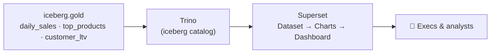

# 7.1 Dashboards from the Gold layer

## Concept
Everyone above you in the org — a category manager, a CFO, the CEO — doesn't open Jupyter or run
`spark-submit`. They open a **dashboard**. Business intelligence (BI) is the last mile: it turns
the Gold marts you built in [Units 4–5](../unit4/spark-sql-gold.md) into charts a human reads in
five seconds.

**Why BI reads Gold — and only Gold:**

- **Small.** Gold is pre-aggregated (`daily_sales` is one row per day, not per order) — charts
  render instantly; a chart over raw Bronze would time out.
- **Safe.** Gold has no PII sprawl or half-cleaned junk. Analysts have no business in Silver/Bronze.
- **Business-ready.** Gold's columns *are* the metrics; no more joins or window functions to explain.



Superset doesn't touch the lake directly — it speaks **SQL over Trino**, which exposes the Gold
marts through its `iceberg` catalog (`iceberg.gold.daily_sales`). The three-step ladder is always:
**Database** (connect to Trino, once) → **Dataset** (register a Gold table) → **Charts → Dashboard**.

## Lab
Open Superset at [http://localhost:8004](http://localhost:8004) (k8s: `superset.de.lan`) and log
in as `admin` / `admin`. Everything here is in the **browser** — no container shell.

### 1. The lakehouse connection (pre-configured)
Superset ships with two Trino connections already set up (**Settings → Database Connections**):

- **ShopFlow Lakehouse** → `trino://trino@trino:8080/iceberg` — the governed Gold layer (this unit).
- **shopflow** → `trino://trino@trino:8080/shopflow/public` — the raw source (Unit 2 SQL Lab).

To add your own (or on another platform, the same idea): **+ Database → Other**, paste the
SQLAlchemy URI, **Test Connection** (*Connection looks good!*), **Connect**.

!!! tip "Check it in SQL Lab first"
    **SQL → SQL Lab**, pick **ShopFlow Lakehouse**, and prove the plumbing before building:

    ```sql
    SELECT * FROM iceberg.gold.daily_sales ORDER BY order_date DESC LIMIT 10;
    ```

### 2. Create Datasets on the Gold marts
**Datasets → + Dataset**: database **ShopFlow Lakehouse**, schema **gold**, table **daily_sales**
→ *Create dataset and create chart*. Repeat for `top_products` and `customer_ltv`.

### 3. Build the charts
**a) Daily revenue — Line Chart** (dataset `gold.daily_sales`)

- **X-axis / Time column**: `order_date` · **Metric**: `SUM(revenue)` · time grain **Day**.
  Name it *Daily Revenue*.

**b) Top products — Bar Chart** (dataset `gold.top_products`)

- **Dimension**: `product_name` · **Metric**: `SUM(revenue)` · **Row limit** 10, sort desc.
  Name it *Top 10 Products*.

**c) Customer LTV** (dataset `gold.customer_ltv`)

- A **Histogram** on `lifetime_value` (the shape of your customer base), plus a **Table** of
  `customer_name`, `lifetime_value` (sorted desc, limit 10) — your VIP list.

**d) Revenue by country — Bar Chart** (dataset `gold.customer_ltv`)

- **Dimension**: `country` · **Metric**: `SUM(lifetime_value)`, sort desc. Name it *Revenue by Country*.

### 4. Assemble the executive dashboard
**Dashboards → + Dashboard** → **ShopFlow — Executive Overview**. Drag the saved charts onto the
grid, add a **Filter** on `order_date` so execs can scope the whole board to a date range. **Save**,
share the URL — that link is the product your whole pipeline exists to deliver.

!!! note "Governance & BI (model vs this stack)"
    On **Databricks**, a BI tool reads Gold through a SQL warehouse and **Unity Catalog enforces
    the grants automatically** — an analyst's dashboard can only surface what their role may read
    (the [Unit 6](../unit6/rbac.md) policy). On this OSS compose stack, Trino/Superset query the
    open `iceberg` catalog (no UC enforcement wired), so *by convention* you point BI at **Gold
    only** and never grant a BI account more than read on Gold. The **pattern** — BI reads the
    small, safe, governed Gold layer — is what transfers.

## Challenge
The CFO wants a **7-day rolling average revenue** to smooth daily spikes. Build it from a SQL Lab
query saved as a dataset.

??? note "Solution"
    ```sql
    SELECT
      order_date,
      revenue,
      AVG(revenue) OVER (
        ORDER BY order_date
        ROWS BETWEEN 6 PRECEDING AND CURRENT ROW
      ) AS revenue_7d_avg
    FROM iceberg.gold.daily_sales
    ORDER BY order_date;
    ```
    In SQL Lab run it, then **Save → Save dataset** as `daily_sales_rolling`. Build a **Line Chart**
    on it with X-axis `order_date` and series `revenue` + `revenue_7d_avg`. The smoothed line shows
    the trend without weekend noise. Add it to the dashboard. (This is the window function from
    [2.3](../unit2/window-functions.md), now driving a CFO chart.)

!!! tip "🎯 The same BI pattern on Azure, Databricks, Snowflake & Fabric"
    **What you just did:** connected a BI tool to the governed Gold layer over SQL and built an
    executive dashboard.

    - **Azure Databricks** — **AI/BI Dashboards** read Unity Catalog Gold tables through a **SQL
      Warehouse** — the same "SQL over governed Gold" path.
    - **Microsoft Fabric** — **Power BI** on the Lakehouse in **Direct Lake** mode reads OneLake
      Delta directly (no import) — the closest analogue to Superset-over-Trino live queries.
    - **Snowflake** — **Snowsight** dashboards over the Gold schema, or Power BI/Tableau on a
      Virtual Warehouse.
    - **Azure Data Factory** — **no BI**; it moves/transforms data, the chart always lives elsewhere.

    Different logos, identical shape: connect → dataset → visuals → dashboard, always over the
    small, safe, governed **Gold** layer — never raw source.

## Key terms, at a glance
| Term | Plain meaning |
|---|---|
| **BI / dashboard** | Charts a non-technical user reads at a glance |
| **Database connection** | Superset → Trino, via a SQLAlchemy URI |
| **Dataset** | A Gold table (or saved query) you can chart |
| **Virtual dataset** | A SQL Lab query saved as a chartable dataset |
| **Chart / dashboard** | A single visual / a canvas of visuals + filters |
| **Why Gold only** | Small, safe, business-ready — never chart Bronze/Silver |

## You can now…
- Explain why BI reads the Gold layer (small, safe, business-ready), never Bronze/Silver
- Connect Superset to the lakehouse over Trino and build datasets, charts, and a dashboard
- Recognise the same "chart from Gold" pattern in Databricks AI/BI, Snowsight, and Power BI
