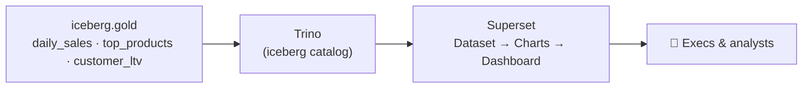

# 7.1 Dashboards from the Gold layer

## Concept
Everyone above you in the org — a category manager, a CFO, the CEO — doesn't open Jupyter or run
`spark-submit`. They open a **dashboard**. This lesson is the last mile of the whole pipeline: you
turn the Gold marts you built in [Units 4–5](../unit4/spark-sql-gold.md) into charts a human reads
in five seconds.

!!! info "What is BI, a dashboard, and a chart?"
    **Business intelligence (BI)** is the practice of turning data into pictures a non-technical
    person can act on. Its three nested pieces:

    - A **chart** is a single visual — one line, one bar chart, one table — that answers *one*
      question ("is revenue growing?").
    - A **dashboard** is a page of several charts arranged together, often with a shared filter
      (e.g. a date range) so an exec can read the whole business at a glance.
    - A **BI tool** (here: **Superset**) is the software that draws them. You'll click through a
      browser UI; the tool writes the SQL and renders the pixels for you.

    The point of BI: a CFO should never have to write SQL. You write it once (or point-and-click
    it), save the result as a chart, and they just *look*.

**Why BI reads Gold — and only Gold:**

This is the rule you first met back in [Unit 1.4](../unit1/medallion.md): BI always sits on the
**Gold** layer, never Bronze or Silver. Three reasons:

- **Small.** Gold is pre-aggregated (`daily_sales` is one row per day, not one per order) — so
  charts render instantly. A chart trying to scan raw Bronze (millions of raw rows) would crawl
  or time out.
- **Safe.** Gold has no PII sprawl or half-cleaned junk. Analysts have no business poking around
  in Silver/Bronze, where a wrong column could leak or mislead.
- **Business-ready.** Gold's columns *are* the finished metrics (`revenue`, `lifetime_value`) — no
  more joins or window functions to explain. You point a chart straight at the number it needs.



**Superset never touches the lake files directly.** It speaks **SQL over Trino** — the same query
engine you used in Unit 2. Trino exposes the Gold marts through its `iceberg` catalog, so a Gold
table like `daily_sales` is addressed as `iceberg.gold.daily_sales`. When you drag a chart around
in Superset, under the hood Superset is sending `SELECT …` statements to Trino and drawing the
answer.

!!! note "The Superset ladder — four rungs, always in this order"
    Everything in this lesson climbs the same ladder. Learn the four rungs once:

    1. **Database connection** — Superset points at Trino. You do this *once* per data source; it's
       just a URL (a "SQLAlchemy URI") that says "talk to Trino, use the `iceberg` catalog."
    2. **Dataset** — you register *one* Gold table (e.g. `gold.daily_sales`) as something
       chartable. A dataset is Superset's handle on a table: which columns exist, which are
       numbers to sum, which are dates.
    3. **Chart** — you pick a dataset and build one visual from it (a line, a bar, a table).
    4. **Dashboard** — you arrange several saved charts on one page and add a filter.

    Database → Dataset → Chart → Dashboard. Every BI tool on earth has these same four rungs under
    different names.

## Lab
Open Superset at [http://localhost:8004](http://localhost:8004) (k8s: `superset.de.lan`) and log
in as `admin` / `admin`. Everything in this lesson happens in the **browser** — there's no
container shell to open, no code to run. You'll click through Superset's menus.

### 1. The lakehouse connection (pre-configured)
The first rung of the ladder is the **database connection**: Superset needs to know *where* the
data lives and *how* to reach it. That "how" is a single line called a **SQLAlchemy URI** — a URL
that names the driver (`trino`), the host (`trino:8080`), and the catalog (`iceberg`). Read
`trino://trino@trino:8080/iceberg` as: "connect with the Trino driver, as user `trino`, to the
Trino server, and default to its `iceberg` catalog."

Superset ships with two Trino connections already set up, so you don't have to build them. Find
them under **Settings → Database Connections**:

- **ShopFlow Lakehouse** → `trino://trino@trino:8080/iceberg` — the governed **Gold** layer (this
  unit). This is the one you'll use.
- **shopflow** → `trino://trino@trino:8080/shopflow/public` — the raw source you queried back in
  Unit 2 SQL Lab. You won't chart from this one — BI reads Gold only.

Because both are pre-configured, you can skip straight to building. But so you can do it on any
platform, here's the general recipe to add a connection yourself: **+ Database → Other**, paste
the SQLAlchemy URI, click **Test Connection** (you want to see *Connection looks good!*), then
**Connect**. That's rung 1, done once.

!!! tip "Check it in SQL Lab first"
    **SQL Lab** is Superset's built-in query editor — a place to type raw SQL and see rows, exactly
    like the Trino CLI. Before building any chart, use it to prove the plumbing works. Go to
    **SQL → SQL Lab**, pick the **ShopFlow Lakehouse** connection, and run:

    ```sql
    SELECT * FROM iceberg.gold.daily_sales ORDER BY order_date DESC LIMIT 10;
    ```

    **Read it step by step:**

    - **`SELECT *`** — return every column. Good for a first look at an unfamiliar table.
    - **`FROM iceberg.gold.daily_sales`** — the fully-qualified Gold table: catalog `iceberg`,
      schema `gold`, table `daily_sales`.
    - **`ORDER BY order_date DESC`** — most recent day first (`DESC` = descending).
    - **`LIMIT 10`** — only the 10 newest rows, so it returns instantly.

    If you get rows back, Trino ↔ Superset ↔ Gold is wired correctly and you're ready to build.

### 2. Create Datasets on the Gold marts
Rung 2 of the ladder: a **dataset** is Superset's registered handle on *one* table. Registering a
Gold table as a dataset tells Superset "these are the columns, this one's a date, these are numbers
you can sum" — the metadata a chart needs to offer you the right options.

**Numbered walkthrough:**

1. Go to **Datasets → + Dataset**.
2. Pick database **ShopFlow Lakehouse** (the Trino connection from step 1).
3. Pick schema **gold**, then table **daily_sales**.
4. Click **Create dataset and create chart** — this saves the dataset and drops you straight into
   the chart builder.
5. Repeat the whole thing for `top_products` and `customer_ltv`. When you're done you have three
   datasets, one per Gold mart.

That's the beauty of Gold: each mart is *already* the answer to a business question, so a dataset
over it needs no further shaping — no joins, no cleanup.

### 3. Build the charts
Rung 3: a **chart** is a single visual built from one dataset. In Superset you pick a dataset, pick
a **visualization type** (line, bar, table, histogram…), then drag columns into roles like *X-axis*,
*Metric*, and *Dimension*. Superset turns those choices into a SQL query against Trino and draws the
result. Two roles you'll use constantly:

- A **Metric** is the *number* being measured — usually an aggregate like `SUM(revenue)`. It's the
  bar's height or the line's Y-value.
- A **Dimension** is the *category* you slice that number by — e.g. `product_name` or `country`.
  It's the label on each bar.

**a) Daily revenue — Line Chart** (dataset `gold.daily_sales`)

A **line chart** plots a metric over time — ideal for a trend ("is revenue growing?"). Time runs
along the X-axis, the metric rises and falls along the Y.

- **X-axis / Time column**: `order_date` · **Metric**: `SUM(revenue)` · time grain **Day**.
  Name it *Daily Revenue*. (**Time grain Day** means one point per day; switch it to *Month* and
  Superset would re-aggregate to one point per month — no new query for you to write.)

**b) Top products — Bar Chart** (dataset `gold.top_products`)

A **bar chart** compares a metric *across categories* — one bar per category, taller = bigger.
Perfect for a ranking.

- **Dimension**: `product_name` · **Metric**: `SUM(revenue)` · **Row limit** 10, sort desc.
  Name it *Top 10 Products*. (**Row limit 10 + sort desc** = keep only the ten biggest bars — a
  clean top-10, not a wall of every product.)

**c) Customer LTV** (dataset `gold.customer_ltv`)

Two different views of the same customer mart:

- A **Histogram** on `lifetime_value`. A histogram buckets a single number column into ranges and
  counts how many rows fall in each — so it shows the *shape* of your customer base (are most
  customers low-value with a few whales, or evenly spread?).
- A **Table** of `customer_name`, `lifetime_value` (sorted desc, limit 10). A **table** chart is
  just rows and columns — the right choice when the exact values matter more than a shape. This one
  is your VIP list: the ten highest-value customers by name.

**d) Revenue by country — Bar Chart** (dataset `gold.customer_ltv`)

Same bar-chart idea as (b), but sliced by country instead of product — proving the point from Unit
2: change the dimension, same metric, a whole new business view.

- **Dimension**: `country` · **Metric**: `SUM(lifetime_value)`, sort desc. Name it *Revenue by Country*.

### 4. Assemble the executive dashboard
Rung 4, the top of the ladder: a **dashboard** is a page that arranges your saved charts together,
with a shared filter so one control drives them all.

**Numbered walkthrough:**

1. Go to **Dashboards → + Dashboard** and name it **ShopFlow — Executive Overview**.
2. From the panel of saved charts, **drag** each one onto the grid — *Daily Revenue*, *Top 10
   Products*, the LTV histogram and table, *Revenue by Country*. Resize and arrange them however
   reads best.
3. Add a **Filter** on `order_date`. A dashboard filter is a single control (here, a date range)
   that Superset applies to *every* chart on the page at once — so an exec can scope the whole
   board to "last quarter" with one click.
4. **Save**, then share the URL.

That link is the product your entire pipeline — Bronze ingest, Silver cleaning, Gold marts — exists
to deliver. Everything upstream was in service of this one page an exec can read in seconds.

!!! note "Governance & BI (model vs this stack)"
    On **Databricks**, a BI tool reads Gold through a SQL warehouse and **Unity Catalog enforces
    the grants automatically** — an analyst's dashboard can only surface what their role may read
    (the [Unit 6](../unit6/rbac.md) policy). On this OSS compose stack, Trino/Superset query the
    **Apache Polaris**-backed `iceberg` catalog without per-user enforcement wired into the query
    path, so *by convention* you point BI at **Gold only** and never grant a BI account more than
    read on Gold. The **pattern** — BI reads the small, safe, governed Gold layer — is what transfers.

## Challenge
The CFO wants a **7-day rolling average revenue** to smooth daily spikes. Build it from a SQL Lab
query saved as a dataset.

So far every dataset was a whole Gold table. But sometimes the number you want isn't a table yet —
it's the result of a *query*. That's what a **virtual dataset** is for: you write a SQL query in
SQL Lab, save it, and Superset treats that saved query as if it were a table you can chart. Nothing
is copied or materialised — Superset just re-runs your SQL against Trino whenever the chart
refreshes. This challenge builds one.

??? note "Solution"
    Run this in SQL Lab (connection **ShopFlow Lakehouse**):

    ```sql
    SELECT
      order_date,
      revenue,
      AVG(revenue) OVER (
        ORDER BY order_date
        ROWS BETWEEN 6 PRECEDING AND CURRENT ROW
      ) AS revenue_7d_avg
    FROM iceberg.gold.daily_sales
    ORDER BY order_date;
    ```

    **Read it step by step:**

    - **`SELECT order_date, revenue`** — keep each day's date and its raw revenue.
    - **`AVG(revenue) OVER (…)`** — this is a **window function** (from [Unit 2.3](../unit2/window-functions.md)).
      Unlike `GROUP BY`, which collapses many rows into one, a window function computes a value
      *for each row* by looking at a "window" of nearby rows — so every day keeps its own row *and*
      gains a rolling average.
    - **`ORDER BY order_date`** (inside the `OVER`) — defines the order the window walks through:
      oldest day to newest.
    - **`ROWS BETWEEN 6 PRECEDING AND CURRENT ROW`** — the window is *this* day plus the 6 days
      before it = 7 days. `AVG` over that window is the 7-day rolling average.
    - **`AS revenue_7d_avg`** — names the smoothed column.
    - **`ORDER BY order_date`** (the final one) — sorts the output for the chart.

    Now save it as a **virtual dataset**: **Save → Save dataset** as `daily_sales_rolling`. Then
    build a **Line Chart** on that dataset with X-axis `order_date` and two series — `revenue` (the
    jagged actuals) and `revenue_7d_avg` (the smooth trend). The rolling line reveals the underlying
    direction without the weekend-vs-weekday noise. Add it to the dashboard. That's the exact window
    function from [Unit 2.3](../unit2/window-functions.md), now driving a live CFO chart.

!!! tip "🎯 The same BI pattern on Azure, Databricks, Snowflake & Fabric"
    **What you just did:** connected a BI tool to the governed Gold layer over SQL and built an
    executive dashboard.

    - **Azure Databricks** — **AI/BI Dashboards** read Unity Catalog Gold tables through a **SQL
      Warehouse** — the same "SQL over governed Gold" path.
    - **Microsoft Fabric** — **Power BI** on the Lakehouse in **Direct Lake** mode reads OneLake
      Delta directly (no import) — the closest analogue to Superset-over-Trino live queries.
    - **Snowflake** — **Snowsight** dashboards over the Gold schema, or Power BI/Tableau on a
      Virtual Warehouse.
    - **Azure Data Factory** — **no BI**; it moves/transforms data, the chart always lives elsewhere.

    Different logos, identical shape: connect → dataset → visuals → dashboard, always over the
    small, safe, governed **Gold** layer — never raw source.

## Key terms, at a glance
| Term | Plain meaning |
|---|---|
| **BI** | Turning data into pictures a non-technical person can act on |
| **Chart** | A single visual (one line / bar / table) answering one question |
| **Dashboard** | A page of several charts + a shared filter, read at a glance |
| **The Superset ladder** | Database → Dataset → Chart → Dashboard (always this order) |
| **Database connection** | Superset → Trino, via a SQLAlchemy URI (done once) |
| **SQLAlchemy URI** | The connection string, e.g. `trino://trino@trino:8080/iceberg` |
| **Dataset** | Superset's registered handle on one Gold table you can chart |
| **Virtual dataset** | A saved SQL Lab query, charted as if it were a table |
| **SQL Lab** | Superset's built-in SQL editor — type SQL, get rows |
| **Metric / Dimension** | The number measured / the category you slice it by |
| **Line / Bar / Histogram / Table** | Trend / ranking / shape of one column / exact rows |
| **Why Gold only** | Small, safe, business-ready — never chart Bronze/Silver |

## You can now…
- Explain why BI reads the Gold layer (small, safe, business-ready), never Bronze/Silver
- Connect Superset to the lakehouse over Trino and build datasets, charts, and a dashboard
- Recognise the same "chart from Gold" pattern in Databricks AI/BI, Snowsight, and Power BI
